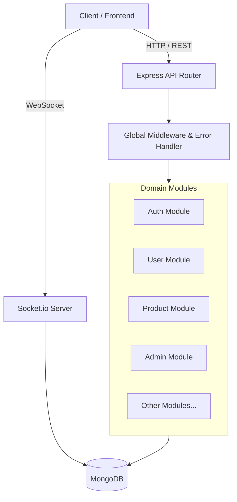
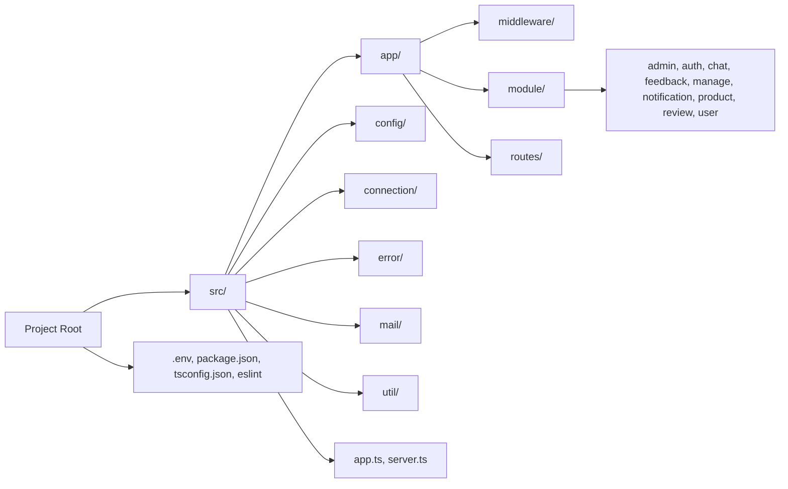
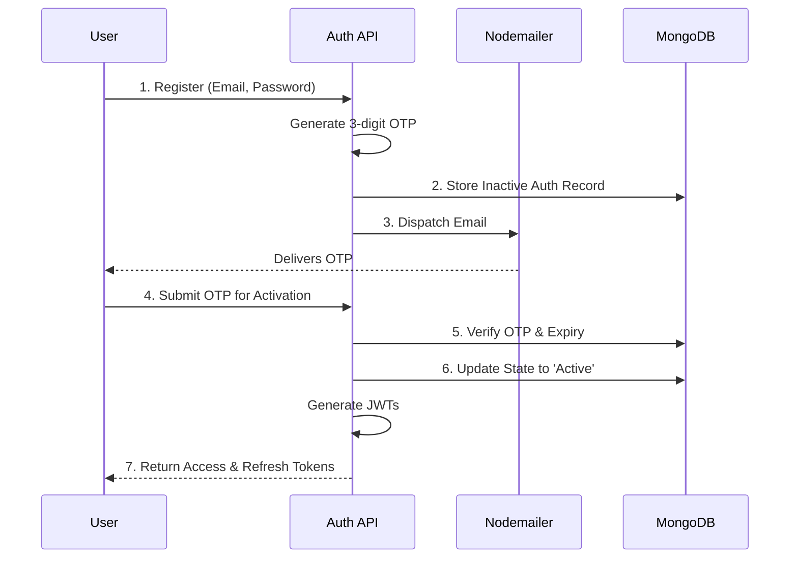
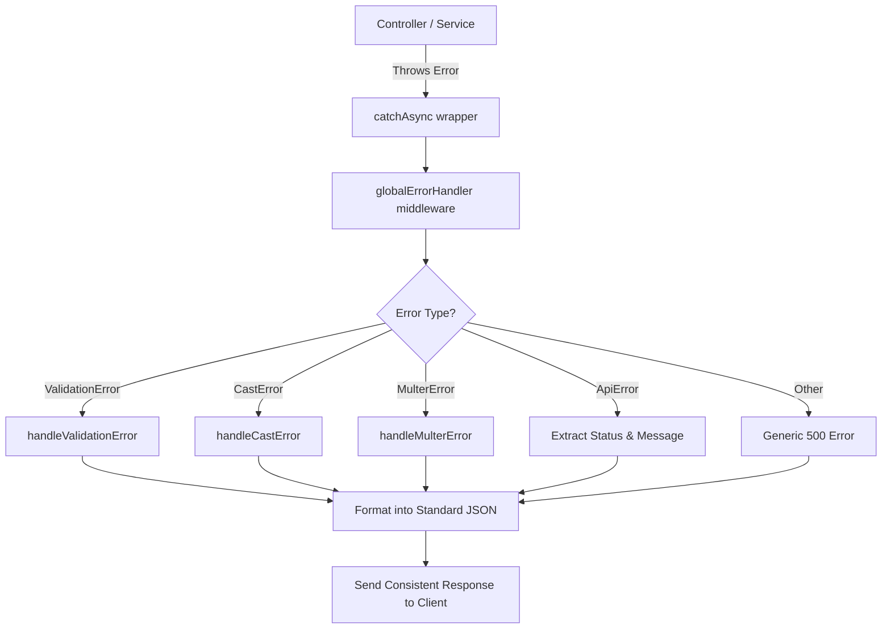

# Project Technical Documentation

This document serves as a comprehensive technical overview of the current project state. It is designed to act as a foundational context guide for AI assistants or developers aiming to use this repository as a starting template for future development.

## 1. High-Level Architecture

This project is a backend RESTful API built on the **Node.js** runtime using the **Express.js** framework with **TypeScript**. It implements a **Modular Monolith Architecture** meaning the business logic is split by domains (e.g., `user`, `auth`, `product`), and each domain has its own encapsulated components (Controllers, Services, Models, Routes).



## 2. Technology Stack

- **Language:** TypeScript
- **Runtime:** Node.js
- **Framework:** Express.js (v5.x)
- **Database Object Modeling (ODM):** Mongoose
- **Database Engine:** MongoDB
- **Authentication:** JSON Web Tokens (JWT) & `bcrypt` for password hashing
- **Real-time Communication:** Socket.io
- **Email Service:** Nodemailer (SMTP based)
- **File Uploads:** Multer (with logic components in utilities)
- **Background Jobs:** Node-cron
- **Payment Gateway Integrations:** Stripe
- **Logging:** Winston & Winston Daily Rotate File
- **Linting and Formatting:** ESLint & Prettier

## 3. Directory Structure



<details>
<summary><strong>Click to view detailed folder tree</strong></summary>

```text
├── src/
│   ├── app/
│   │   ├── middleware/       # Shared Express middlewares (e.g., Auth checkers, Global Error Handlers, File Uploaders)
│   │   ├── module/           # Modularized domain logic
│   │   │   ├── admin/        # Admin profile definitions and routes
│   │   │   ├── auth/         # Handles Registration, Login, OTP verification
│   │   │   ├── chat/         # Real-time chat integration endpoints
│   │   │   ├── feedback/     # User feedback mechanisms
│   │   │   ├── manage/       # Application configuration content (Terms, Privacy Policy, FAQ, etc.)
│   │   │   ├── notification/ # Stores and retrieves system/app notifications
│   │   │   ├── product/      # CRUD management for food products by merchants/users
│   │   │   ├── review/       # Product and merchant reviews
│   │   │   └── user/         # User profile definitions and mutations
│   │   └── routes/           # Central API Router index mapping (`index.ts`)
│   ├── config/               # Processes `.env` environmental variables
│   ├── connection/           # System level connections
│   │   ├── connectDB.ts      # Mongoose MongoDB connection
│   │   ├── socket.ts         # Configures the Socket.io WebSocket server
│   │   └── socketCors.ts     # Socket.io CORS configuration
│   ├── error/                # Custom Error classes and custom error transformers
│   │   ├── ApiError.ts       # Standardized API Error Thrower
│   │   ├── globalErrorHandler.ts  # Main catcher and formatter
│   │   └── NotFoundHandler.ts     # 404 handler
│   ├── mail/                 # Email templates processing
│   ├── util/                 # Project-wide utility helper scripts (e.g., `logger.ts`, `jwtHelpers.ts`, `generateModule.ts`)
│   ├── app.ts                # Core Express application setup and bindings
│   └── server.ts             # Starting execution point linking Express, Sockets, and Mongoose
├── .env.example              # Sample environment constraints needed to run the project
├── tsconfig.json             # TypeScript compiler configuration
├── eslint.config.mjs         # ESLint configuration
└── package.json              # Includes dependency manifests and dev scripts (e.g., `make:file`)
```

</details>

## 4. Core System Workflows

### Authentication and Authorization

The auth system uses a multi-layered approach involving **Two Databases Collections** conceptually tied together:

- `Auth`: Central authority for system credentials. Holds `email`, `password`, `role` (ADMIN, USER), OTP codes, and activation statuses.
- `User` | `Admin`: Sub-profile attachments tied via the `authId`. These maintain separate, domain-specific profile details without polluting credentials logic.



- **Registration Flow:** User registers -> System generates a 3-digit activation code -> Sends code to email (Nodemailer) -> Stores inactive user state.
- **Activation Flow:** User inputs OTP -> System verifies OTP expiry -> State transitions to active -> JWT (Access/Refresh pairs) issued.
- Periodic cleanup runs in the background (`node-cron`) to prune unverified, expired OTP credentials from the DB.

### Error Handling

The repository employs centralized and graceful error handling strategies. Using an `ApiError` utility (combining http-status codes and custom messages), any errors thrown within modules are bubbled up to `globalErrorHandler`.



- Auto-handles `ValidationError`, `CastError`, `MulterError`, `DuplicateKeyError`, etc.
- Parses backend-specific errors and formats them into a strict, predictable JSON interface for frontend consumption:
  ```json
  {
      "success": false,
      "message": "Error reason",
      "errorMessages": [...Array of specific field breakdowns]
  }
  ```

### Real-time Communication

Integrated via Socket.io, initialized in `src/connection/socket.ts`. The project is already hooked up alongside the Express listening port dynamically allowing dual HTTP + WS usage over the single API port.

## 5. Using as a Template: Best Practices

For AI assistants or developers utilizing this template structure:

1. **Domain Creation Script**: The project includes a `generateModule.ts` inside `src/util`. You can invoke it via `npm run make:file` (or configure AI to utilize it) to instantly bootstrap standard boilerplate (`model`, `controller`, `service`, `routes`) folders and TypeScript files for new entities within `src/app/module`.
2. **Environment Setup**: Copy `.env.example` to `.env` locally. Key integrations require proper config strings: MongoDB URI, JWT Secrets, SMPT Credentials, and Stripe keys.
3. **Database Interactions**: When building on top of the DB logic, ensure to rely on `lean()` during massive mongoose `.find()` fetches to improve performance logic, and remember that any authentication/role specific checking should run through the underlying `Auth` collection, not directly via domain structures unless for Profile fetching.
4. **File Handling**: There are strong unlinking tools existing under `src/util/unlinkFile.ts` and `src/util/deleteUploadedFiles.ts` to clear server memory footprint safely.

## 6. Base Database Collections

These are the core established collections, typically handled by their discrete domains:

- `auths` - Core authentication / login credentials
- `admins` - Profile specific schema mapped to `auth.role = ADMIN`
- `users` - Profile specific schema mapped to `auth.role = USER`
- `notifications` - App ecosystem notifications
- `products` - FoodProduct data linked to merchants
- `manages` - Dynamic application content like Terms and Conditions, Privacy Policy, etc. (Collections: `termsconditions`, `privacypolicies`, `faqs`, etc.)
