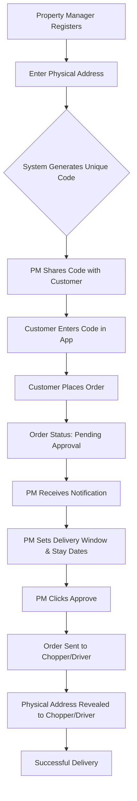

# Short-Term Rental Delivery Workflow

This workflow bridges the gap between a short-term rental host and a delivery service, ensuring addresses remain private while managing the logistics of perishable goods.

---

## The Property Manager (PM) Journey

### Phase 1: Property Setup

1.  **Registration:** PM creates an account and navigates to the "Properties" section.
2.  **Listing:** PM enters the physical address of their rental.
3.  **Code Generation:** The system assigns a permanent, unique 5–7 digit Property Code to that specific address.
4.  **External Sharing:** The PM shares this code with their customer outside of the platform (e.g., via Airbnb/VRBO/booking messaging) before check-in.

### Phase 2: Customer Interaction & Ordering

1.  **Code Input:** The customer opens the app and enters the Property Code in the "Address" field.
2.  **Shopping:** The customer browses stores and adds items to their cart.
3.  **Order Placement:** The customer places the order.
4.  **Pending State:** The order is held in a "Pending Host Approval" status. The customer is notified that the host must confirm a delivery window.

### Phase 3: PM Approval

1.  **Notification:** The PM receives a notification: "New delivery request for Property [Code/Name]."
2.  **Scheduling:** The PM opens the request and defines the Delivery Window (e.g., "Monday, 2:00 PM – 4:00 PM").
3.  **Authorization:** The PM hits Approve.

### Phase 4: Fulfillment

1.  **Chopper Assignment:** Once approved, the order becomes visible to the "Chopper/Driver" role.
2.  **Address Disclosure:** Only at this stage is the physical address revealed to the Chopper for navigation.
3.  **Completion:** The Chopper delivers within the PM’s specified window.

---

## Logic Flow

