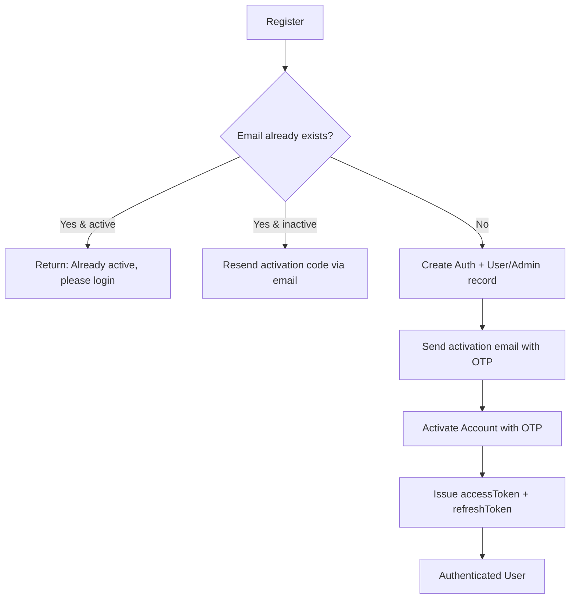
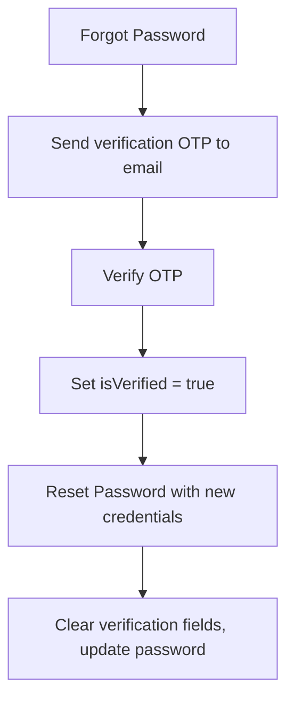

# Auth Module — API Documentation

> **Base Path:** `/auth`
> **Source:** [`src/app/module/auth`](file:///C:/Users/thakursaad/projects/happyphoto/src/app/module/auth)

---

## Table of Contents

- [Overview](#overview)
- [Authentication Flows](#authentication-flows)
- [Routes](#routes)
  - [POST /auth/register](#1-post-authregister)
  - [POST /auth/activate-account](#2-post-authactivate-account)
  - [POST /auth/activation-code-resend](#3-post-authactivation-code-resend)
  - [POST /auth/login](#4-post-authlogin)
  - [POST /auth/forgot-password](#5-post-authforgot-password)
  - [POST /auth/forget-pass-otp-verify](#6-post-authforget-pass-otp-verify)
  - [POST /auth/reset-password](#7-post-authreset-password)
  - [PATCH /auth/change-password](#8-patch-authchange-password)
- [Error Reference](#error-reference)
- [Background Jobs](#background-jobs)

---

## Overview

The Auth module handles all identity-related operations: registration, email-based account activation via OTP, login with JWT issuance, and the full forgot-password / reset-password flow. It also supports authenticated password changes.

**Supported Roles:** `USER`, `PROPERTY_HOST`, `DRIVER`, `MERCHANT`, `ADMIN`

---

## Authentication Flows





---

## Routes

---

### 1. POST `/auth/register`

Creates a new user account and sends an activation OTP to the provided email.

| Property       | Value         |
| -------------- | ------------- |
| **Auth**       | None (Public) |
| **Rate Limit** | No            |

#### Request Body

```json
{
  "name": "John Doe",
  "email": "john@example.com",
  "password": "SecureP@ss1",
  "confirmPassword": "SecureP@ss1",
  "role": "USER",
  "phoneNumber": "+1234567890"
}
```

| Field             | Type   | Required | Description                                                    |
| ----------------- | ------ | -------- | -------------------------------------------------------------- |
| `name`            | string | ✅       | Full name of the user                                          |
| `email`           | string | ✅       | Must be a valid email address                                  |
| `password`        | string | ✅       | Account password                                               |
| `confirmPassword` | string | ✅       | Must match `password`                                          |
| `role`            | string | ✅       | One of: `USER`, `PROPERTY_HOST`, `DRIVER`, `MERCHANT`, `ADMIN` |
| `phoneNumber`     | string | ❌       | Optional phone number                                          |

#### Response — Success (New account)

```json
{
  "statusCode": 200,
  "success": true,
  "message": "Account created successfully. Please check your email",
  "data": {
    "isActive": false,
    "message": "Account created successfully. Please check your email"
  }
}
```

#### Response — Email already exists (inactive account)

```json
{
  "statusCode": 400,
  "success": false,
  "message": "Already have an account. Please activate",
  "data": {
    "isActive": false,
    "message": "Already have an account. Please activate"
  }
}
```

#### Response — Email already exists (active account)

```json
{
  "statusCode": 400,
  "success": false,
  "message": "Account active. Please Login",
  "data": {
    "isActive": true,
    "message": "Account active. Please Login"
  }
}
```

#### Errors

| Status | Condition                                |
| ------ | ---------------------------------------- |
| 400    | Missing required fields                  |
| 400    | Invalid role                             |
| 400    | Password and confirmPassword don't match |

#### Notes

- For `DRIVER` role, `isApproved` is automatically set to `false` on the User record.
- For `ADMIN` role, the record is created in the `Admin` collection instead of `User`, and no activation email is sent.
- If the email already exists but the account is inactive, the activation code is refreshed and a new email is sent.

---

### 2. POST `/auth/activate-account`

Verifies the activation OTP sent during registration and activates the account. Returns JWT tokens on success.

| Property       | Value         |
| -------------- | ------------- |
| **Auth**       | None (Public) |
| **Rate Limit** | No            |

#### Request Body

```json
{
  "email": "john@example.com",
  "activationCode": "123456"
}
```

| Field            | Type   | Required | Description                        |
| ---------------- | ------ | -------- | ---------------------------------- |
| `email`          | string | ✅       | The email used during registration |
| `activationCode` | string | ✅       | The OTP code received via email    |

#### Response — Success

```json
{
  "statusCode": 201,
  "success": true,
  "message": "Activation code verified successfully.",
  "data": {
    "accessToken": "eyJhbGciOiJIUzI1NiIs...",
    "refreshToken": "eyJhbGciOiJIUzI1NiIs..."
  }
}
```

#### Cookies Set

| Cookie         | Value      | HttpOnly | Secure (prod) |
| -------------- | ---------- | -------- | ------------- |
| `refreshToken` | JWT string | ✅       | ✅            |

#### Errors

| Status | Condition                                            |
| ------ | ---------------------------------------------------- |
| 404    | User not found for the provided email                |
| 404    | No activation code exists (request a new one)        |
| 400    | Activation code has expired                          |
| 400    | Activation code doesn't match                        |
| 404    | Account detail not found (User/Admin record missing) |

#### JWT Token Payload

```json
{
  "authId": "ObjectId",
  "userId": "ObjectId",
  "email": "john@example.com",
  "role": "USER"
}
```

---

### 3. POST `/auth/activation-code-resend`

Generates a new activation OTP and sends it to the user's email.

| Property       | Value         |
| -------------- | ------------- |
| **Auth**       | None (Public) |
| **Rate Limit** | No            |

#### Request Body

```json
{
  "email": "john@example.com"
}
```

| Field   | Type   | Required | Description                       |
| ------- | ------ | -------- | --------------------------------- |
| `email` | string | ✅       | The email of the inactive account |

#### Response — Success

```json
{
  "statusCode": 200,
  "success": true,
  "message": "Resent successfully"
}
```

#### Errors

| Status | Condition                   |
| ------ | --------------------------- |
| 400    | Email not found in database |

---

### 4. POST `/auth/login`

Authenticates a user with email and password. Returns JWT tokens on success.

| Property       | Value                                      |
| -------------- | ------------------------------------------ |
| **Auth**       | None (Public)                              |
| **Rate Limit** | ✅ **10 requests per hour** per IP address |

#### Request Body

```json
{
  "email": "john@example.com",
  "password": "SecureP@ss1"
}
```

| Field      | Type   | Required | Description      |
| ---------- | ------ | -------- | ---------------- |
| `email`    | string | ✅       | Registered email |
| `password` | string | ✅       | Account password |

#### Response — Success

```json
{
  "statusCode": 200,
  "success": true,
  "message": "Log in successful",
  "data": {
    "accessToken": "eyJhbGciOiJIUzI1NiIs...",
    "refreshToken": "eyJhbGciOiJIUzI1NiIs..."
  }
}
```

#### Cookies Set

| Cookie         | Value      | HttpOnly | Secure (prod) |
| -------------- | ---------- | -------- | ------------- |
| `refreshToken` | JWT string | ✅       | ✅            |

#### Errors

| Status | Condition                         |
| ------ | --------------------------------- |
| 404    | User does not exist               |
| 400    | Account not activated             |
| 403    | User is blocked                   |
| 400    | Password is incorrect             |
| 404    | Account detail not found          |
| 400    | Rate limit exceeded (10 req/hour) |

---

### 5. POST `/auth/forgot-password`

Initiates the password reset flow by sending a verification OTP to the user's email.

| Property       | Value         |
| -------------- | ------------- |
| **Auth**       | None (Public) |
| **Rate Limit** | No            |

#### Request Body

```json
{
  "email": "john@example.com"
}
```

| Field   | Type   | Required | Description                   |
| ------- | ------ | -------- | ----------------------------- |
| `email` | string | ✅       | Email of the account to reset |

#### Response — Success

```json
{
  "statusCode": 200,
  "success": true,
  "message": "Check your email!"
}
```

#### Errors

| Status | Condition      |
| ------ | -------------- |
| 400    | Missing email  |
| 400    | User not found |

---

### 6. POST `/auth/forget-pass-otp-verify`

Verifies the OTP code sent during the forgot-password flow. Sets `isVerified` to `true` on the Auth record, enabling the password reset step.

| Property       | Value         |
| -------------- | ------------- |
| **Auth**       | None (Public) |
| **Rate Limit** | No            |

#### Request Body

```json
{
  "email": "john@example.com",
  "code": "654321"
}
```

| Field   | Type   | Required | Description                             |
| ------- | ------ | -------- | --------------------------------------- |
| `email` | string | ✅       | Email of the account                    |
| `code`  | string | ✅       | The verification OTP received via email |

#### Response — Success

```json
{
  "statusCode": 200,
  "success": true,
  "message": "Code verified successfully"
}
```

#### Errors

| Status | Condition                     |
| ------ | ----------------------------- |
| 400    | Missing email                 |
| 404    | Account does not exist        |
| 404    | No verification code found    |
| 400    | Verification code has expired |
| 400    | Invalid verification code     |

---

### 7. POST `/auth/reset-password`

Resets the user's password after successful OTP verification. Requires `isVerified` to be `true` (set by the OTP verify step).

| Property       | Value         |
| -------------- | ------------- |
| **Auth**       | None (Public) |
| **Rate Limit** | No            |

#### Request Body

```json
{
  "email": "john@example.com",
  "newPassword": "NewSecureP@ss1",
  "confirmPassword": "NewSecureP@ss1"
}
```

| Field             | Type   | Required | Description              |
| ----------------- | ------ | -------- | ------------------------ |
| `email`           | string | ✅       | Email of the account     |
| `newPassword`     | string | ✅       | The new password         |
| `confirmPassword` | string | ✅       | Must match `newPassword` |

#### Response — Success

```json
{
  "statusCode": 200,
  "success": true,
  "message": "Password has been reset successfully."
}
```

#### Errors

| Status | Condition                      |
| ------ | ------------------------------ |
| 400    | Passwords do not match         |
| 404    | User not found                 |
| 403    | OTP verification not completed |

#### Notes

- After a successful reset, the `isVerified`, `verificationCode`, and `verificationCodeExpire` fields are all cleared from the Auth record.
- The new password is hashed with bcrypt before storage.

---

### 8. PATCH `/auth/change-password`

Changes the password for the currently authenticated user. Requires the old password for verification.

| Property       | Value                                      |
| -------------- | ------------------------------------------ |
| **Auth**       | ✅ **Required** — Bearer Token (all roles) |
| **Rate Limit** | No                                         |

#### Headers

```
Authorization: Bearer <accessToken>
```

#### Request Body

```json
{
  "oldPassword": "OldP@ss1",
  "newPassword": "NewSecureP@ss1",
  "confirmPassword": "NewSecureP@ss1"
}
```

| Field             | Type   | Required | Description              |
| ----------------- | ------ | -------- | ------------------------ |
| `oldPassword`     | string | ✅       | Current account password |
| `newPassword`     | string | ✅       | The new password         |
| `confirmPassword` | string | ✅       | Must match `newPassword` |

#### Response — Success

```json
{
  "statusCode": 200,
  "success": true,
  "message": "Password changed successfully!"
}
```

#### Errors

| Status | Condition                                   |
| ------ | ------------------------------------------- |
| 401    | Missing or invalid auth token               |
| 400    | Missing required fields                     |
| 400    | newPassword and confirmPassword don't match |
| 404    | Account does not exist                      |
| 400    | Old password is incorrect                   |

---

## Error Reference

All error responses follow a consistent shape:

```json
{
  "statusCode": 400,
  "success": false,
  "message": "Descriptive error message",
  "errorMessages": [
    {
      "path": "",
      "message": "Descriptive error message"
    }
  ]
}
```

| HTTP Status | Meaning                                            |
| ----------- | -------------------------------------------------- |
| 400         | Bad Request — validation failed or incorrect input |
| 401         | Unauthorized — missing or invalid token            |
| 403         | Forbidden — blocked account or OTP not verified    |
| 404         | Not Found — resource doesn't exist                 |
| 429         | Too Many Requests — rate limit exceeded            |

---

## Background Jobs

A cron job runs **every 10 minutes** to clean up expired OTP codes:

| Task                             | Schedule       | Action                                                                                    |
| -------------------------------- | -------------- | ----------------------------------------------------------------------------------------- |
| Clean expired activation codes   | `*/10 * * * *` | Unsets `activationCode` and `activationCodeExpire` for expired records                    |
| Clean expired verification codes | `*/10 * * * *` | Unsets `isVerified`, `verificationCode`, and `verificationCodeExpire` for expired records |

> **Source:** [`auth.service.ts`](file:///C:/Users/thakursaad/projects/happyphoto/src/app/module/auth/auth.service.ts#L422-L433)
