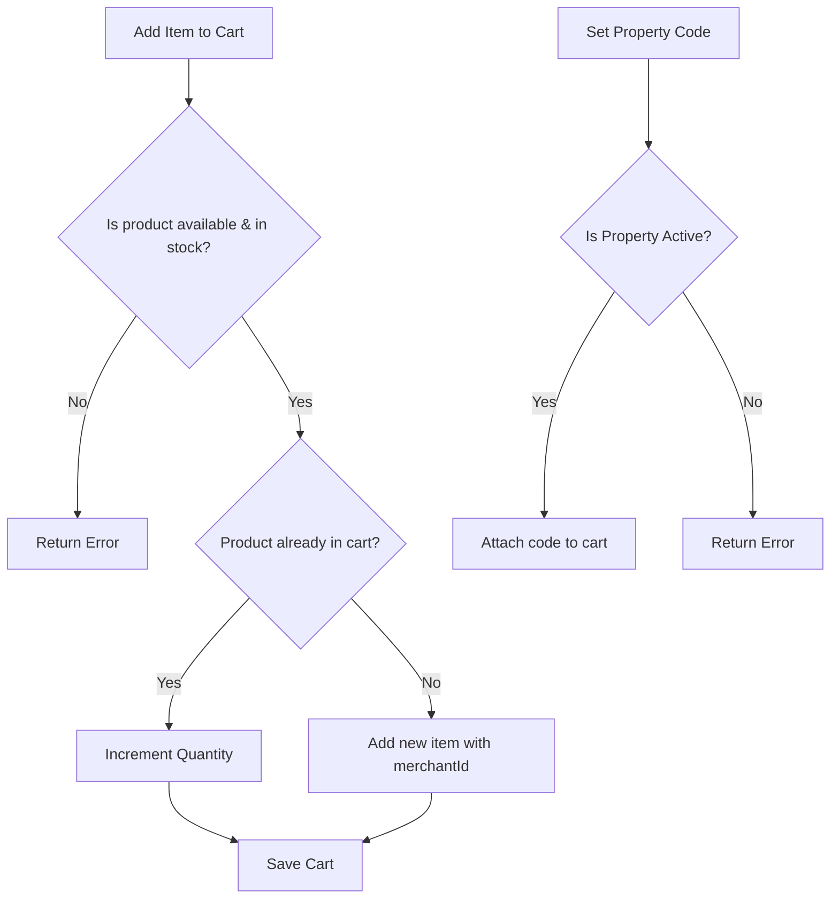

# Cart Module — API Documentation

> **Base Path:** `/cart`
> **Source:** [`src/app/module/cart`](file:///C:/Users/thakursaad/projects/happyphoto/src/app/module/cart)

---

## Table of Contents

- [Overview](#overview)
- [Cart Data Flow](#cart-data-flow)
- [Routes](#routes)
  - [GET /cart/get-cart](#1-get-cartget-cart)
  - [POST /cart/add-item](#2-post-cartadd-item)
  - [PATCH /cart/update-item](#3-patch-cartupdate-item)
  - [DELETE /cart/remove-item](#4-delete-cartremove-item)
  - [DELETE /cart/clear-cart](#5-delete-cartclear-cart)
  - [PATCH /cart/set-property-code](#6-patch-cartset-property-code)
- [Error Reference](#error-reference)

---

## Overview

The Cart module manages a user's shopping cart. It allows users to add products (validating stock and availability), update item quantities, remove items, clear the cart entirely, and attach a `propertyCode` to the cart for logistics/delivery routing.

**All routes in this module require `USER` authentication.**

---

## Cart Data Flow



---

## Routes

### 1. GET `/cart/get-cart`

Retrieves the authenticated user's current cart. If no cart exists, a new empty cart is created and returned.

| Property | Value     |
| -------- | --------- |
| **Auth** | ✅ `USER` |

#### Response — Success

```json
{
  "statusCode": 200,
  "success": true,
  "message": "Cart retrieved successfully",
  "data": {
    "_id": "ObjectId",
    "userId": "ObjectId",
    "items": [
      {
        "productId": {
          "_id": "ObjectId",
          "name": "Vintage Camera",
          "product_image": "url/to/image.jpg",
          "price": 120,
          "category": "Electronics",
          "quantity": 5
        },
        "merchantId": {
          "_id": "ObjectId",
          "storeName": "Camera Shop",
          "store_logo": "url/to/logo.png"
        },
        "quantity": 2,
        "price": 120
      }
    ],
    "propertyCode": "XYZ-123"
  }
}
```

---

### 2. POST `/cart/add-item`

Adds a product to the user's cart. Validates product availability and stock constraints before adding.

| Property | Value     |
| -------- | --------- |
| **Auth** | ✅ `USER` |

#### Request Body

```json
{
  "productId": "ObjectId",
  "quantity": 2
}
```

| Field       | Type   | Required | Description                       |
| ----------- | ------ | -------- | --------------------------------- |
| `productId` | string | ✅       | ID of the product to add          |
| `quantity`  | number | ✅       | Quantity to add (must be $\ge$ 1) |

#### Response — Success

```json
{
  "statusCode": 200,
  "success": true,
  "message": "Item added to cart",
  "data": {
    "userId": "ObjectId",
    "items": [ ... ]
  }
}
```

#### Errors

| Status | Condition                                 |
| ------ | ----------------------------------------- |
| 404    | Product not found                         |
| 400    | Product is not available (inactive)       |
| 400    | Insufficient stock for requested quantity |

---

### 3. PATCH `/cart/update-item`

Updates the quantity of an existing item in the cart. If the quantity is set to 0 or less, the item is automatically removed.

| Property | Value     |
| -------- | --------- |
| **Auth** | ✅ `USER` |

#### Request Body

```json
{
  "productId": "ObjectId",
  "quantity": 3
}
```

| Field       | Type   | Required | Description                            |
| ----------- | ------ | -------- | -------------------------------------- |
| `productId` | string | ✅       | ID of the product in the cart          |
| `quantity`  | number | ✅       | New quantity (removes item if $\le$ 0) |

#### Response — Success

```json
{
  "statusCode": 200,
  "success": true,
  "message": "Cart item updated",
  "data": { ... }
}
```

#### Errors

| Status | Condition              |
| ------ | ---------------------- |
| 404    | Cart not found         |
| 404    | Item not found in cart |

---

### 4. DELETE `/cart/remove-item`

Removes a specific product from the cart completely.

| Property | Value     |
| -------- | --------- |
| **Auth** | ✅ `USER` |

#### Request Body

```json
{
  "productId": "ObjectId"
}
```

| Field       | Type   | Required | Description                 |
| ----------- | ------ | -------- | --------------------------- |
| `productId` | string | ✅       | ID of the product to remove |

#### Response — Success

```json
{
  "statusCode": 200,
  "success": true,
  "message": "Item removed from cart",
  "data": { ... }
}
```

#### Errors

| Status | Condition      |
| ------ | -------------- |
| 404    | Cart not found |

---

### 5. DELETE `/cart/clear-cart`

Removes all items from the cart and unsets the `propertyCode`.

| Property | Value     |
| -------- | --------- |
| **Auth** | ✅ `USER` |

#### Response — Success

```json
{
  "statusCode": 200,
  "success": true,
  "message": "Cart cleared",
  "data": {
    "userId": "ObjectId",
    "items": [],
    "propertyCode": null
  }
}
```

#### Errors

| Status | Condition      |
| ------ | -------------- |
| 404    | Cart not found |

---

### 6. PATCH `/cart/set-property-code`

Attaches a delivery destination (Property) to the cart using its unique `propertyCode`. This code is validated against active properties before attaching.

| Property | Value     |
| -------- | --------- |
| **Auth** | ✅ `USER` |

#### Request Body

```json
{
  "propertyCode": "XYZ-123"
}
```

| Field          | Type   | Required | Description                                     |
| -------------- | ------ | -------- | ----------------------------------------------- |
| `propertyCode` | string | ✅       | The unique active code of the delivery property |

#### Response — Success

```json
{
  "statusCode": 200,
  "success": true,
  "message": "Property code set on cart",
  "data": { ... }
}
```

#### Errors

| Status | Condition                         |
| ------ | --------------------------------- |
| 404    | Property not found or is inactive |

---

## Error Reference

All error responses follow the standard application shape:

```json
{
  "statusCode": 400,
  "success": false,
  "message": "Descriptive error message",
  "errorMessages": [ ... ]
}
```

| HTTP Status | Meaning                                                            |
| ----------- | ------------------------------------------------------------------ |
| 400         | Bad Request — validation failed, inactive product, or stock issues |
| 401         | Unauthorized — missing or invalid token                            |
| 404         | Not Found — Cart, Product, or Property missing                     |
