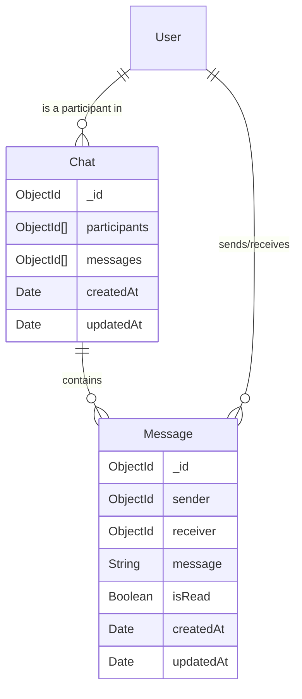

# Chat Module — API Documentation

> **Base Path:** `/chat`
> **Source:** [`src/app/module/chat`](file:///C:/Users/thakursaad/projects/happyphoto/src/app/module/chat)

---

## Table of Contents

- [Overview](#overview)
- [Chat System Architecture](#chat-system-architecture)
- [Routes](#routes)
  - [POST /chat/post-chat](#1-post-chatpost-chat)
  - [GET /chat/get-all-chats](#2-get-chatget-all-chats)
  - [GET /chat/get-chat-messages](#3-get-chatget-chat-messages)
  - [PATCH /chat/update-message-as-seen](#4-patch-chatupdate-message-as-seen)
- [Error Reference](#error-reference)

---

## Overview

The Chat module handles initiating conversations between two users (e.g., driver and customer), fetching inbox listings (with unread message counts), retrieving paginated messages for a single chat, and marking messages as seen.

**Note:** The actual real-time message sending logic is assumed to be handled over a WebSocket (e.g., Socket.IO) connection. These REST endpoints manage the data models, initiation, and retrieval.

**All routes in this module are available to all authenticated roles (`config.auth_level.all`).**

---

## Chat System Architecture



---

## Routes

### 1. POST `/chat/post-chat`

Initiates a new conversation (or returns the existing one) between the logged-in user and a target receiver. Sends push notifications to both parties.

| Property | Value        |
| -------- | ------------ |
| **Auth** | ✅ All Roles |

#### Request Body

```json
{
  "receiverId": "ObjectId"
}
```

| Field        | Type   | Required | Description                                 |
| ------------ | ------ | -------- | ------------------------------------------- |
| `receiverId` | string | ✅       | ID of the user to start a conversation with |

#### Response — Success

```json
{
  "statusCode": 200,
  "success": true,
  "message": "Chat initiated",
  "data": {
    "_id": "ObjectId",
    "participants": ["ObjectId_UserA", "ObjectId_UserB"],
    "messages": []
  }
}
```

#### Errors

| Status | Condition                  |
| ------ | -------------------------- |
| 400    | Missing `receiverId` field |
| 404    | Logged-in user not found   |
| 404    | Receiver not found         |

---

### 2. GET `/chat/get-all-chats`

Retrieves the inbox/listing of all chats the authenticated user is participating in. It runs an aggregation pipeline to compute the `unRead` message count for each chat.

| Property | Value        |
| -------- | ------------ |
| **Auth** | ✅ All Roles |

#### Response — Success

```json
{
  "statusCode": 200,
  "success": true,
  "message": "Chats retrieved",
  "data": {
    "chats": [
      {
        "_id": "ObjectId",
        "participants": [
          {
            "_id": "ObjectId",
            "name": "Jane Doe",
            "profile_image": "url/to/image.jpg"
          },
          {
            "_id": "ObjectId",
            "name": "Delivery Driver"
          }
        ],
        "messages": ["MsgId1", "MsgId2"],
        "unRead": 3
      }
    ]
  }
}
```

---

### 3. GET `/chat/get-chat-messages`

Retrieves a paginated list of messages for a specific chat. Messages are sorted newest-first. The response includes the chat details with populated participants.

| Property       | Value        |
| -------------- | ------------ |
| **Auth**       | ✅ All Roles |
| **Pagination** | ✅ Yes       |

#### Query Parameters

| Field    | Type   | Required | Default | Description                     |
| -------- | ------ | -------- | ------- | ------------------------------- |
| `chatId` | string | ✅       | -       | The ID of the chat conversation |
| `page`   | number | ❌       | 1       | Page number                     |
| `limit`  | number | ❌       | 10      | Number of messages per page     |

#### Response — Success

```json
{
  "statusCode": 200,
  "success": true,
  "message": "Chat retrieved",
  "data": {
    "meta": {
      "page": 1,
      "limit": 10,
      "total": 24,
      "totalPage": 3
    },
    "_id": "ObjectId",
    "participants": [
      {
        "_id": "ObjectId",
        "name": "Jane Doe",
        "phoneNumber": "+123456789",
        "profile_image": "url/image.jpg"
      }
    ],
    "messages": [
      {
        "_id": "ObjectId",
        "sender": "ObjectId",
        "receiver": "ObjectId",
        "message": "I have arrived at the property.",
        "isRead": true,
        "createdAt": "2023-10-01T12:05:00.000Z"
      }
    ]
  }
}
```

#### Errors

| Status | Condition                        |
| ------ | -------------------------------- |
| 400    | Missing `chatId` query parameter |
| 404    | Chat not found                   |

---

### 4. PATCH `/chat/update-message-as-seen`

Marks all unread messages in a specific chat as seen (`isRead: true`), specifically messages where the authenticated user is the _receiver_.

| Property | Value        |
| -------- | ------------ |
| **Auth** | ✅ All Roles |

#### Request Body

```json
{
  "chatId": "ObjectId"
}
```

| Field    | Type   | Required | Description                    |
| -------- | ------ | -------- | ------------------------------ |
| `chatId` | string | ✅       | ID of the chat to mark as read |

#### Response — Success

```json
{
  "statusCode": 200,
  "success": true,
  "message": "Message updated as seen",
  "data": {
    "acknowledged": true,
    "modifiedCount": 3,
    "upsertedId": null,
    "upsertedCount": 0,
    "matchedCount": 3
  }
}
```

#### Errors

| Status | Condition              |
| ------ | ---------------------- |
| 400    | Missing `chatId` field |
| 404    | Chat not found         |

---

## Error Reference

All error responses follow the standard application shape:

```json
{
  "statusCode": 400,
  "success": false,
  "message": "Descriptive error message",
  "errorMessages": [ ... ]
}
```

| HTTP Status | Meaning                                           |
| ----------- | ------------------------------------------------- |
| 400         | Bad Request — validation failed or missing field  |
| 401         | Unauthorized — missing or invalid token           |
| 404         | Not Found — user, chat, or message does not exist |
