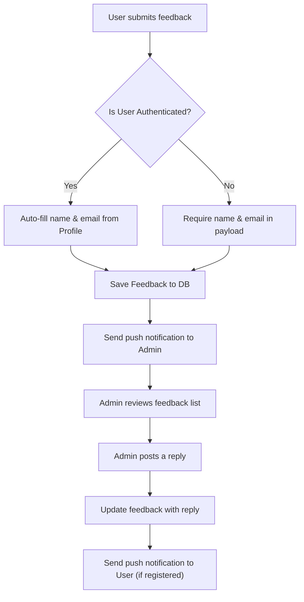

# Feedback Module — API Documentation

> **Base Path:** `/feedback`
> **Source:** [`src/app/module/feedback`](file:///C:/Users/thakursaad/projects/happyphoto/src/app/module/feedback)

---

## Table of Contents

- [Overview](#overview)
- [Feedback Flow](#feedback-flow)
- [Routes](#routes)
  - [POST /feedback/post-feedback](#1-post-feedbackpost-feedback)
  - [GET /feedback/get-feedback](#2-get-feedbackget-feedback)
  - [GET /feedback/get-all-feedbacks](#3-get-feedbackget-all-feedbacks)
  - [PATCH /feedback/update-feedback-with-reply](#4-patch-feedbackupdate-feedback-with-reply)
  - [DELETE /feedback/delete-feedback](#5-delete-feedbackdelete-feedback)
- [Error Reference](#error-reference)

---

## Overview

The Feedback module allows users (both registered and guests) to submit feedback or support requests to the platform. Administrators can view all feedback and post replies, which automatically triggers a push notification to the original user (if registered).

---

## Feedback Flow



---

## Routes

### 1. POST `/feedback/post-feedback`

Submits new feedback. **Authentication is optional.** If the user is authenticated, their `name` and `email` are pulled automatically. If they are a guest, `name` and `email` must be provided in the request body.

| Property | Value                      |
| -------- | -------------------------- |
| **Auth** | Optional (`USER` or Guest) |

#### Request Body (Guest)

```json
{
  "name": "Jane Doe",
  "email": "jane@example.com",
  "feedback": "The app is running a bit slow on my older device."
}
```

#### Request Body (Authenticated)

```json
{
  "feedback": "Great service, the driver arrived right on time!"
}
```

| Field      | Type   | Required | Description                          |
| ---------- | ------ | -------- | ------------------------------------ |
| `feedback` | string | ✅       | The actual feedback or question      |
| `name`     | string | ✅\*     | Required _only_ if not authenticated |
| `email`    | string | ✅\*     | Required _only_ if not authenticated |

#### Response — Success

```json
{
  "statusCode": 200,
  "success": true,
  "message": "Feedback posted",
  "data": {
    "user": "ObjectId",
    "name": "Jane Doe",
    "email": "jane@example.com",
    "feedback": "Great service, the driver arrived right on time!",
    "_id": "ObjectId",
    "createdAt": "2023-10-01T12:00:00.000Z"
  }
}
```

---

### 2. GET `/feedback/get-feedback`

Retrieves a single feedback document by ID.

| Property | Value     |
| -------- | --------- |
| **Auth** | ✅ `USER` |

#### Query Parameters

| Field        | Type   | Required | Description            |
| ------------ | ------ | -------- | ---------------------- |
| `feedbackId` | string | ✅       | The feedback object ID |

---

### 3. GET `/feedback/get-all-feedbacks`

Retrieves a paginated list of feedbacks.

- If called by an **Admin**, it returns _all_ feedback on the platform.
- If called by a standard **User**, it returns _only their own_ feedback.

| Property       | Value               |
| -------------- | ------------------- |
| **Auth**       | ✅ `USER` / `ADMIN` |
| **Pagination** | ✅ Yes              |

#### Query Parameters

| Field        | Type   | Required | Description    |
| ------------ | ------ | -------- | -------------- |
| `searchTerm` | string | ❌       | Search text    |
| `page`       | number | ❌       | Page number    |
| `limit`      | number | ❌       | Limit per page |

#### Response — Success

```json
{
  "statusCode": 200,
  "success": true,
  "message": "Feedback retrieved",
  "data": {
    "meta": { "page": 1, "limit": 10, "total": 5 },
    "feedback": [
      {
        "_id": "ObjectId",
        "name": "Jane Doe",
        "email": "jane@example.com",
        "feedback": "Great service!",
        "reply": "Thank you so much Jane!"
      }
    ]
  }
}
```

---

### 4. PATCH `/feedback/update-feedback-with-reply`

Allows an Admin to post a reply to a user's feedback. Triggers a push notification to the user if the feedback is linked to a registered account.

| Property | Value      |
| -------- | ---------- |
| **Auth** | ✅ `ADMIN` |

#### Request Body

```json
{
  "feedbackId": "ObjectId",
  "reply": "Thank you for letting us know, we will look into this immediately."
}
```

| Field        | Type   | Required | Description            |
| ------------ | ------ | -------- | ---------------------- |
| `feedbackId` | string | ✅       | The target feedback ID |
| `reply`      | string | ✅       | The admin's reply text |

---

### 5. DELETE `/feedback/delete-feedback`

Deletes a specific feedback document.

| Property | Value               |
| -------- | ------------------- |
| **Auth** | ✅ `USER` / `ADMIN` |

#### Request Body

```json
{
  "feedbackId": "ObjectId"
}
```

---

## Error Reference

| HTTP Status | Meaning                                      |
| ----------- | -------------------------------------------- |
| 400         | Bad Request — missing required fields        |
| 401         | Unauthorized — token missing or invalid      |
| 404         | Not Found — feedback document does not exist |
