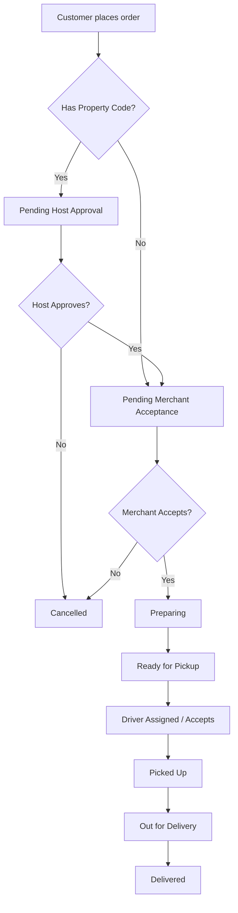

# Order Module — API Documentation

> **Base Path:** `/order`
> **Source:** [`src/app/module/order`](file:///C:/Users/thakursaad/projects/happyphoto/src/app/module/order)

---

## Table of Contents

- [Overview](#overview)
- [Order Flows](#order-flows)
- [Routes](#routes)
  - [POST /order/place-order](#1-post-orderplace-order)
  - [GET /order/get-order](#2-get-orderget-order)
  - [GET /order/get-my-orders](#3-get-orderget-my-orders)
  - [GET /order/track](#4-get-ordertrack)
  - [PATCH /order/accept-order](#5-patch-orderaccept-order)
  - [PATCH /order/update-status](#6-patch-orderupdate-status)
  - [GET /order/active-orders](#7-get-orderactive-orders)
  - [GET /order/pending-requests](#8-get-orderpending-requests)
  - [PATCH /order/assign-driver](#9-patch-orderassign-driver)
  - [PATCH /order/accept-delivery](#10-patch-orderaccept-delivery)
  - [PATCH /order/decline-delivery](#11-patch-orderdecline-delivery)
  - [PATCH /order/picked-up](#12-patch-orderpicked-up)
  - [PATCH /order/out-for-delivery](#13-patch-orderout-for-delivery)
  - [PATCH /order/deliver](#14-patch-orderdeliver)
  - [PATCH /order/cancel-order](#15-patch-ordercancel-order)
- [Error Reference](#error-reference)

---

## Overview

The Order module manages the end-to-end lifecycle of an order, including placement by users, acceptance and updates by merchants, delivery assignment and tracking by drivers, and cancellations across different roles. It supports regular deliveries as well as property-specific orders requiring host approval.

**Supported Roles:** `USER`, `PROPERTY_HOST`, `DRIVER`, `MERCHANT`, `ADMIN`

---

## Order Flows



---

## Routes

---

### 1. POST `/order/place-order`

Places a new order based on the user's cart contents. Generates one order per merchant if the cart contains items from multiple merchants.

| Property       | Value                                   |
| -------------- | --------------------------------------- |
| **Auth**       | ✅ **Required** — Bearer Token (`USER`) |
| **Rate Limit** | No                                      |

#### Request Body

<!-- source: src/app/module/order/order.service.ts -->

```json
{
  "propertyCode": "STAY123",
  "deliveryAddress": "123 Main St",
  "deliveryLat": "40.7128",
  "deliveryLong": "-74.0060",
  "specialInstructions": "Leave at the door"
}
```

| Field                 | Type   | Required | Description                                                   |
| --------------------- | ------ | -------- | ------------------------------------------------------------- |
| `propertyCode`        | string | ❌       | Property code if ordering to a guest stay                     |
| `deliveryAddress`     | string | ❌       | Delivery address (required if `propertyCode` is not provided) |
| `deliveryLat`         | string | ❌       | Delivery latitude coordinate                                  |
| `deliveryLong`        | string | ❌       | Delivery longitude coordinate                                 |
| `specialInstructions` | string | ❌       | Any special instructions for merchant/driver                  |

#### Response — Success

<!-- source: src/app/module/order/Order.ts -->

```json
{
  "statusCode": 200,
  "success": true,
  "message": "Order placed successfully",
  "data": [
    {
      "_id": "65ab3c...",
      "orderId": "ORD-12345",
      "status": "pending",
      "subtotal": 25.5,
      "deliveryFee": 5,
      "serviceFee": 2,
      "total": 32.5,
      "items": [
        {
          "productId": "65ab1...",
          "name": "Burger",
          "price": 12.75,
          "quantity": 2
        }
      ]
    }
  ]
}
```

#### Notes

- The cart is automatically cleared upon successful order placement.
- If ordered to a property (`propertyCode`), the initial status is `pending_host_approval`.
- Delivery address is hidden from regular users until property host approves.

---

### 2. GET `/order/get-order`

Retrieves the details of a specific order by ID.

| Property       | Value                                  |
| -------------- | -------------------------------------- |
| **Auth**       | ✅ **Required** — Bearer Token (`ALL`) |
| **Rate Limit** | No                                     |

#### Query Parameters

<!-- source: src/app/module/order/order.service.ts -->

| Field     | Type   | Required | Description |
| --------- | ------ | -------- | ----------- |
| `orderId` | string | ✅       | Order ID    |

#### Response — Success

<!-- source: src/app/module/order/Order.ts -->

```json
{
  "statusCode": 200,
  "success": true,
  "message": "Order retrieved",
  "data": {
    "_id": "65ab3c...",
    "orderId": "ORD-12345",
    "status": "pending",
    "userId": { ... },
    "merchantId": { ... },
    "items": [ ... ]
  }
}
```

---

### 3. GET `/order/get-my-orders`

Retrieves a paginated list of orders associated with the authenticated user. Contextual based on the user's role (User sees their orders, Merchant sees their store's orders, Driver sees their deliveries).

| Property       | Value                                  |
| -------------- | -------------------------------------- |
| **Auth**       | ✅ **Required** — Bearer Token (`ALL`) |
| **Rate Limit** | No                                     |

#### Query Parameters

For standard pagination and sorting parameters, see [Shared Pagination Rules](_shared.md#pagination--filtering).

<!-- source: src/app/module/order/order.service.ts -->

| Field    | Type   | Required | Description      |
| -------- | ------ | -------- | ---------------- |
| `status` | string | ❌       | Filter by status |

#### Response — Success

<!-- source: src/app/module/order/Order.ts -->

```json
{
  "statusCode": 200,
  "success": true,
  "message": "Orders retrieved",
  "data": [ ... ],
  "meta": {
    "page": 1,
    "limit": 10,
    "total": 24
  }
}
```

---

### 4. GET `/order/track`

Tracks the status and driver location for an active order.

| Property       | Value                                   |
| -------------- | --------------------------------------- |
| **Auth**       | ✅ **Required** — Bearer Token (`USER`) |
| **Rate Limit** | No                                      |

#### Query Parameters

<!-- source: src/app/module/order/order.service.ts -->

| Field     | Type   | Required | Description |
| --------- | ------ | -------- | ----------- |
| `orderId` | string | ✅       | Order ID    |

#### Response — Success

<!-- source: src/app/module/order/order.service.ts -->

```json
{
  "statusCode": 200,
  "success": true,
  "message": "Order tracking data retrieved",
  "data": {
    "order": { ... },
    "driverLocation": {
      "type": "Point",
      "coordinates": [-74.0060, 40.7128]
    }
  }
}
```

---

### 5. PATCH `/order/accept-order`

Accepts an order, transitioning it to `accepted_by_merchant`.

| Property       | Value                                       |
| -------------- | ------------------------------------------- |
| **Auth**       | ✅ **Required** — Bearer Token (`MERCHANT`) |
| **Rate Limit** | No                                          |

#### Request Body

<!-- source: src/app/module/order/order.service.ts -->

```json
{
  "orderId": "65ab3c..."
}
```

| Field     | Type   | Required | Description |
| --------- | ------ | -------- | ----------- |
| `orderId` | string | ✅       | Order ID    |

#### Response — Success

<!-- source: src/app/module/order/Order.ts -->

```json
{
  "statusCode": 200,
  "success": true,
  "message": "Order accepted",
  "data": { ... }
}
```

---

### 6. PATCH `/order/update-status`

Updates the status of an order currently in progress by the merchant.

| Property       | Value                                       |
| -------------- | ------------------------------------------- |
| **Auth**       | ✅ **Required** — Bearer Token (`MERCHANT`) |
| **Rate Limit** | No                                          |

#### Request Body

<!-- source: src/app/module/order/order.service.ts -->

```json
{
  "orderId": "65ab3c...",
  "status": "preparing"
}
```

| Field     | Type   | Required | Description                                        |
| --------- | ------ | -------- | -------------------------------------------------- |
| `orderId` | string | ✅       | Order ID                                           |
| `status`  | string | ✅       | New status (e.g., `preparing`, `ready_for_pickup`) |

#### Notes

- Allowed transitions: `accepted_by_merchant` → `preparing`, `preparing` → `ready_for_pickup`.

---

### 7. GET `/order/active-orders`

Retrieves a paginated list of currently active orders assigned to the authenticated driver (`driver_assigned`, `picked_up`, `out_for_delivery`).

| Property       | Value                                     |
| -------------- | ----------------------------------------- |
| **Auth**       | ✅ **Required** — Bearer Token (`DRIVER`) |
| **Rate Limit** | No                                        |

#### Query Parameters

For standard pagination and sorting parameters, see [Shared Pagination Rules](_shared.md#pagination--filtering).

#### Response — Success

<!-- source: src/app/module/order/Order.ts -->

```json
{
  "statusCode": 200,
  "success": true,
  "message": "Active orders retrieved",
  "data": [ ... ],
  "meta": { ... }
}
```

---

### 8. GET `/order/pending-requests`

Retrieves a paginated list of orders that are `ready_for_pickup` but have no driver assigned yet.

| Property       | Value                                     |
| -------------- | ----------------------------------------- |
| **Auth**       | ✅ **Required** — Bearer Token (`DRIVER`) |
| **Rate Limit** | No                                        |

#### Query Parameters

For standard pagination and sorting parameters, see [Shared Pagination Rules](_shared.md#pagination--filtering).

#### Response — Success

<!-- source: src/app/module/order/Order.ts -->

```json
{
  "statusCode": 200,
  "success": true,
  "message": "Pending delivery requests retrieved",
  "data": [ ... ],
  "meta": { ... }
}
```

---

### 9. PATCH `/order/assign-driver`

Manually assigns a driver to an order.

| Property       | Value                                    |
| -------------- | ---------------------------------------- |
| **Auth**       | ✅ **Required** — Bearer Token (`ADMIN`) |
| **Rate Limit** | No                                       |

#### Request Body

<!-- source: src/app/module/order/order.service.ts -->

```json
{
  "orderId": "65ab3c...",
  "driverId": "65ac4d..."
}
```

| Field      | Type   | Required | Description |
| ---------- | ------ | -------- | ----------- |
| `orderId`  | string | ✅       | Order ID    |
| `driverId` | string | ✅       | Driver ID   |

#### Response — Success

<!-- source: src/app/module/order/Order.ts -->

```json
{
  "statusCode": 200,
  "success": true,
  "message": "Driver assigned",
  "data": { ... }
}
```

---

### 10. PATCH `/order/accept-delivery`

Accepts an available delivery request by a driver. Transitions status to `driver_assigned`.

| Property       | Value                                     |
| -------------- | ----------------------------------------- |
| **Auth**       | ✅ **Required** — Bearer Token (`DRIVER`) |
| **Rate Limit** | No                                        |

#### Request Body

<!-- source: src/app/module/order/order.service.ts -->

```json
{
  "orderId": "65ab3c..."
}
```

| Field     | Type   | Required | Description |
| --------- | ------ | -------- | ----------- |
| `orderId` | string | ✅       | Order ID    |

#### Response — Success

<!-- source: src/app/module/order/Order.ts -->

```json
{
  "statusCode": 200,
  "success": true,
  "message": "Delivery accepted",
  "data": { ... }
}
```

---

### 11. PATCH `/order/decline-delivery`

Declines a delivery request by a driver (currently acts as an acknowledgment).

| Property       | Value                                     |
| -------------- | ----------------------------------------- |
| **Auth**       | ✅ **Required** — Bearer Token (`DRIVER`) |
| **Rate Limit** | No                                        |

#### Request Body

_(No payload required)_

#### Response — Success

<!-- source: src/app/module/order/order.controller.ts -->

```json
{
  "statusCode": 200,
  "success": true,
  "message": "Delivery declined — you may accept another"
}
```

---

### 12. PATCH `/order/picked-up`

Marks an order as picked up by the driver.

| Property       | Value                                     |
| -------------- | ----------------------------------------- |
| **Auth**       | ✅ **Required** — Bearer Token (`DRIVER`) |
| **Rate Limit** | No                                        |

#### Request Body

<!-- source: src/app/module/order/order.service.ts -->

```json
{
  "orderId": "65ab3c..."
}
```

| Field     | Type   | Required | Description |
| --------- | ------ | -------- | ----------- |
| `orderId` | string | ✅       | Order ID    |

#### Response — Success

<!-- source: src/app/module/order/Order.ts -->

```json
{
  "statusCode": 200,
  "success": true,
  "message": "Order picked up",
  "data": { ... }
}
```

---

### 13. PATCH `/order/out-for-delivery`

Marks an order as out for delivery.

| Property       | Value                                     |
| -------------- | ----------------------------------------- |
| **Auth**       | ✅ **Required** — Bearer Token (`DRIVER`) |
| **Rate Limit** | No                                        |

#### Request Body

<!-- source: src/app/module/order/order.service.ts -->

```json
{
  "orderId": "65ab3c..."
}
```

| Field     | Type   | Required | Description |
| --------- | ------ | -------- | ----------- |
| `orderId` | string | ✅       | Order ID    |

#### Response — Success

<!-- source: src/app/module/order/Order.ts -->

```json
{
  "statusCode": 200,
  "success": true,
  "message": "Order is out for delivery",
  "data": { ... }
}
```

---

### 14. PATCH `/order/deliver`

Marks an order as delivered. Requires multipart/form-data for proof of delivery image upload.

| Property       | Value                                     |
| -------------- | ----------------------------------------- |
| **Auth**       | ✅ **Required** — Bearer Token (`DRIVER`) |
| **Rate Limit** | No                                        |

#### Request Body (multipart/form-data)

<!-- source: src/app/module/order/order.service.ts -->

| Field               | Type   | Required | Description                      |
| ------------------- | ------ | -------- | -------------------------------- |
| `orderId`           | string | ✅       | Order ID                         |
| `proof_of_delivery` | file   | ❌       | Image proof of delivery (upload) |

#### Response — Success

<!-- source: src/app/module/order/Order.ts -->

```json
{
  "statusCode": 200,
  "success": true,
  "message": "Order delivered successfully",
  "data": { ... }
}
```

---

### 15. PATCH `/order/cancel-order`

Cancels an order. Allowed conditionally based on the user's role and the current status of the order.

| Property       | Value                                  |
| -------------- | -------------------------------------- |
| **Auth**       | ✅ **Required** — Bearer Token (`ALL`) |
| **Rate Limit** | No                                     |

#### Request Body

<!-- source: src/app/module/order/order.service.ts -->

```json
{
  "orderId": "65ab3c...",
  "reason": "Customer requested cancellation"
}
```

| Field     | Type   | Required | Description                 |
| --------- | ------ | -------- | --------------------------- |
| `orderId` | string | ✅       | Order ID                    |
| `reason`  | string | ❌       | Reason for the cancellation |

#### Response — Success

<!-- source: src/app/module/order/Order.ts -->

```json
{
  "statusCode": 200,
  "success": true,
  "message": "Order cancelled",
  "data": { ... }
}
```

#### Notes

- **USER** can cancel if status is: `pending`, `pending_host_approval`, `accepted_by_merchant`.
- **MERCHANT** can cancel if status is: `pending`, `approved`, `accepted_by_merchant`, `preparing`.
- **PROPERTY_HOST** can cancel if status is: `pending_host_approval`.
- Refund processes or payment cancellations are automatically handled if the order was paid.

---

## Error Reference

For common error envelopes, refer to [Shared Error Reference](_shared.md#error-reference).

<!-- source: src/app/module/order/order.service.ts -->

| HTTP Status | Condition                                                                    |
| ----------- | ---------------------------------------------------------------------------- |
| 400         | Missing required fields (e.g., `orderId`), Cart is empty, Insufficient stock |
| 401         | Unauthorized — missing or invalid token                                      |
| 403         | Forbidden — Order doesn't belong to the user, Invalid permissions            |
| 404         | Order, Product, Property, or Driver not found                                |
