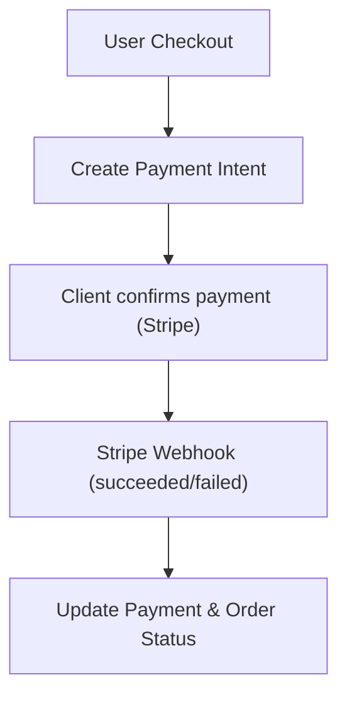
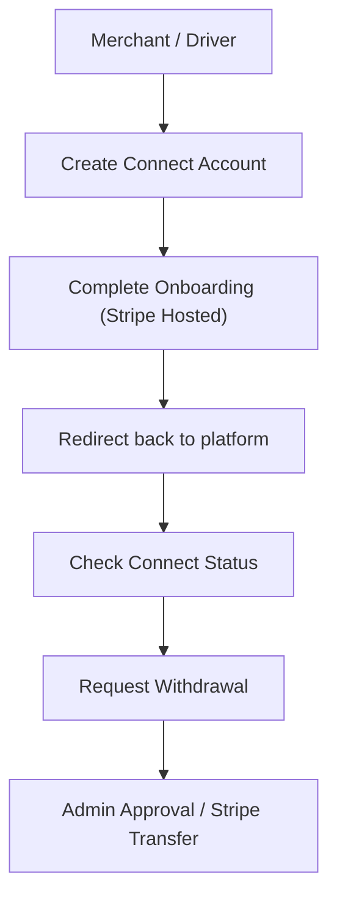

# Payment Module — API Documentation

> **Base Path:** `/payment`
> **Source:** [`src/app/module/payment`](file:///C:/Users/thakursaad/projects/happyphoto/src/app/module/payment)

---

## Table of Contents

- [Overview](#overview)
- [Payment Flows](#payment-flows)
- [Routes](#routes)
  - [POST /payment/create-intent](#1-post-paymentcreate-intent)
  - [GET /payment/get-payment](#2-get-paymentget-payment)
  - [POST /payment/refund](#3-post-paymentrefund)
  - [POST /payment/create-connect-account](#4-post-paymentcreate-connect-account)
  - [GET /payment/connect-status](#5-get-paymentconnect-status)
  - [POST /payment/request-withdrawal](#6-post-paymentrequest-withdrawal)
  - [GET /payment/my-payouts](#7-get-paymentmy-payouts)
  - [GET /payment/my-earnings](#8-get-paymentmy-earnings)
  - [GET /payment/my-transactions](#9-get-paymentmy-transactions)
  - [POST /stripe/webhook](#10-post-stripewebhook)
- [Error Reference](#error-reference)

---

## Overview

The Payment module handles Stripe integrations including charging users for orders via PaymentIntents, handling refunds, onboarding merchants and drivers via Stripe Connect, and processing their withdrawals/payouts.

---

## Payment Flows





---

## Routes

---

### 1. POST `/payment/create-intent`

Creates a Stripe PaymentIntent for an order.

| Property       | Value                                            |
| -------------- | ------------------------------------------------ |
| **Auth**       | ✅ **Required** — Bearer Token (`USER`, `ADMIN`) |
| **Rate Limit** | No                                               |

#### Request Body

```json
{
  "orderId": "65123456789abcdef0123456",
  "currency": "usd"
}
```

| Field      | Type   | Required | Description                       |
| ---------- | ------ | -------- | --------------------------------- |
| `orderId`  | string | ✅       | ID of the order to pay for        |
| `currency` | string | ❌       | Currency code (defaults to `usd`) |

#### Response — Success

```json
{
  "statusCode": 200,
  "success": true,
  "message": "Payment intent created",
  "data": {
    "clientSecret": "pi_3..._secret_...",
    "paymentIntentId": "pi_3...",
    "paymentId": "65123456789abcdef0123456"
  }
}
```

<!-- source: src/app/module/payment/payment.service.ts -->

---

### 2. GET `/payment/get-payment`

Retrieves a payment's details and its associated order information.

| Property       | Value                                      |
| -------------- | ------------------------------------------ |
| **Auth**       | ✅ **Required** — Bearer Token (All roles) |
| **Rate Limit** | No                                         |

#### Query Parameters

| Parameter   | Type   | Required               | Description         |
| ----------- | ------ | ---------------------- | ------------------- |
| `paymentId` | string | ✅ (if no `orderId`)   | Payment document ID |
| `orderId`   | string | ✅ (if no `paymentId`) | Associated Order ID |

#### Response — Success

```json
{
  "statusCode": 200,
  "success": true,
  "message": "Payment retrieved",
  "data": {
    "_id": "65123456789abcdef0123456",
    "orderId": {
      "_id": "...",
      "orderId": "ORD-123",
      "status": "pending",
      "total": 100
    },
    "userId": "...",
    "stripePaymentIntentId": "pi_...",
    "amount": 10000,
    "currency": "usd",
    "status": "succeeded"
  }
}
```

<!-- source: src/app/module/payment/payment.service.ts -->

---

### 3. POST `/payment/refund`

Refunds a succeeded payment.

| Property       | Value                                    |
| -------------- | ---------------------------------------- |
| **Auth**       | ✅ **Required** — Bearer Token (`ADMIN`) |
| **Rate Limit** | No                                       |

#### Request Body

```json
{
  "paymentId": "65123456789abcdef0123456",
  "amount": 50,
  "reason": "requested_by_customer"
}
```

| Field       | Type   | Required | Description                                               |
| ----------- | ------ | -------- | --------------------------------------------------------- |
| `paymentId` | string | ✅       | ID of the payment to refund                               |
| `amount`    | number | ❌       | Amount to refund in dollars (defaults to full refund)     |
| `reason`    | string | ❌       | Refund reason (e.g. `requested_by_customer`, `duplicate`) |

#### Response — Success

```json
{
  "statusCode": 200,
  "success": true,
  "message": "Refund processed",
  "data": {
    "_id": "...",
    "status": "partially_refunded",
    "refundAmount": 50,
    "refundReason": "requested_by_customer"
  }
}
```

<!-- source: src/app/module/payment/payment.service.ts -->

---

### 4. POST `/payment/create-connect-account`

Generates an onboarding link for Stripe Connect.

| Property       | Value                                                 |
| -------------- | ----------------------------------------------------- |
| **Auth**       | ✅ **Required** — Bearer Token (`MERCHANT`, `DRIVER`) |
| **Rate Limit** | No                                                    |

#### Response — Success

```json
{
  "statusCode": 200,
  "success": true,
  "message": "Connect account created",
  "data": {
    "accountLink": "https://connect.stripe.com/setup/..."
  }
}
```

<!-- source: src/app/module/payment/payment.service.ts -->

---

### 5. GET `/payment/connect-status`

Checks the Stripe Connect onboarding status for the current user.

| Property       | Value                                      |
| -------------- | ------------------------------------------ |
| **Auth**       | ✅ **Required** — Bearer Token (All roles) |
| **Rate Limit** | No                                         |

#### Response — Success

```json
{
  "statusCode": 200,
  "success": true,
  "message": "Connect status retrieved",
  "data": {
    "onboarded": true,
    "accountId": "acct_1..."
  }
}
```

<!-- source: src/app/module/payment/payment.service.ts -->

---

### 6. POST `/payment/request-withdrawal`

Requests a manual withdrawal of available balance.

| Property       | Value                                      |
| -------------- | ------------------------------------------ |
| **Auth**       | ✅ **Required** — Bearer Token (All roles) |
| **Rate Limit** | No                                         |

#### Request Body

```json
{
  "amount": 50
}
```

| Field    | Type   | Required | Description                      |
| -------- | ------ | -------- | -------------------------------- |
| `amount` | number | ✅       | Amount to withdraw (minimum $10) |

#### Response — Success

```json
{
  "statusCode": 200,
  "success": true,
  "message": "Withdrawal request submitted",
  "data": {
    "_id": "...",
    "userId": "...",
    "amount": 50,
    "type": "manual_withdrawal",
    "status": "pending"
  }
}
```

<!-- source: src/app/module/payment/payment.service.ts -->

---

### 7. GET `/payment/my-payouts`

Retrieves payout records for the authenticated user.

| Property       | Value                                      |
| -------------- | ------------------------------------------ |
| **Auth**       | ✅ **Required** — Bearer Token (All roles) |
| **Rate Limit** | No                                         |

#### Query Parameters

Supports standard pagination and filtering (see `docs/api/_shared.md`), plus:

| Parameter | Type   | Required | Description                                    |
| --------- | ------ | -------- | ---------------------------------------------- |
| `status`  | string | ❌       | Filter by status (e.g. `pending`, `completed`) |

#### Response — Success

```json
{
  "statusCode": 200,
  "success": true,
  "message": "Payouts retrieved",
  "meta": {
    "page": 1,
    "limit": 10,
    "total": 1,
    "totalPage": 1
  },
  "data": [
    {
      "_id": "...",
      "amount": 50,
      "status": "completed",
      "type": "manual_withdrawal"
    }
  ]
}
```

<!-- source: src/app/module/payment/payment.service.ts -->

---

### 8. GET `/payment/my-earnings`

Retrieves summarized earnings for a specified period.

| Property       | Value                                      |
| -------------- | ------------------------------------------ |
| **Auth**       | ✅ **Required** — Bearer Token (All roles) |
| **Rate Limit** | No                                         |

#### Query Parameters

| Parameter | Type   | Required | Description                                      |
| --------- | ------ | -------- | ------------------------------------------------ |
| `period`  | string | ❌       | `today`, `week`, or `month` (defaults to `week`) |

#### Response — Success

```json
{
  "statusCode": 200,
  "success": true,
  "message": "Earnings retrieved",
  "data": {
    "total": 150.5,
    "perOrder": 15.05,
    "orderCount": 10
  }
}
```

<!-- source: src/app/module/payment/payment.service.ts -->

---

### 9. GET `/payment/my-transactions`

Retrieves a paginated list of transactions/orders delivered by the merchant.

| Property       | Value                                                |
| -------------- | ---------------------------------------------------- |
| **Auth**       | ✅ **Required** — Bearer Token (`MERCHANT`, `ADMIN`) |
| **Rate Limit** | No                                                   |

#### Query Parameters

Supports standard pagination and filtering (see `docs/api/_shared.md`).

#### Response — Success

```json
{
  "statusCode": 200,
  "success": true,
  "message": "Transactions retrieved",
  "meta": {
    "page": 1,
    "limit": 10,
    "total": 5,
    "totalPage": 1
  },
  "data": [
    {
      "_id": "...",
      "orderId": "ORD-...",
      "subtotal": 100,
      "platformCommission": 10,
      "merchantNetEarnings": 90,
      "total": 110,
      "deliveryFee": 10,
      "createdAt": "2023-01-01T00:00:00.000Z"
    }
  ]
}
```

<!-- source: src/app/module/payment/payment.service.ts -->

---

### 10. POST `/stripe/webhook`

Handles incoming webhook events from Stripe to asynchronously update payment statuses.

| Property       | Value                                      |
| -------------- | ------------------------------------------ |
| **Auth**       | None (Public, requires `stripe-signature`) |
| **Rate Limit** | No                                         |

#### Request Headers

| Header             | Required | Description                                |
| ------------------ | -------- | ------------------------------------------ |
| `stripe-signature` | ✅       | Verification signature from Stripe payload |

#### Response — Success

```json
{
  "received": true
}
```

#### Errors

| Status | Condition                                    |
| ------ | -------------------------------------------- |
| 400    | Missing or invalid `stripe-signature` header |

<!-- source: src/app/module/payment/payment.webhook.ts -->

---

## Error Reference

For general error shapes, see [`docs/api/_shared.md`](_shared.md).

Specific error conditions for Payment endpoints:

| HTTP Status | Condition                                          |
| ----------- | -------------------------------------------------- |
| 400         | Missing required fields (e.g. `orderId`, `amount`) |
| 400         | Minimum withdrawal amount not met                  |
| 400         | Order is already paid                              |
| 400         | Insufficient balance for withdrawal                |
| 400         | Stripe API or Webhook signature errors             |
| 403         | Paying for an order that belongs to another user   |
| 403         | Initiating Connect onboarding with incorrect role  |
| 404         | Order, Payment, or User not found                  |
