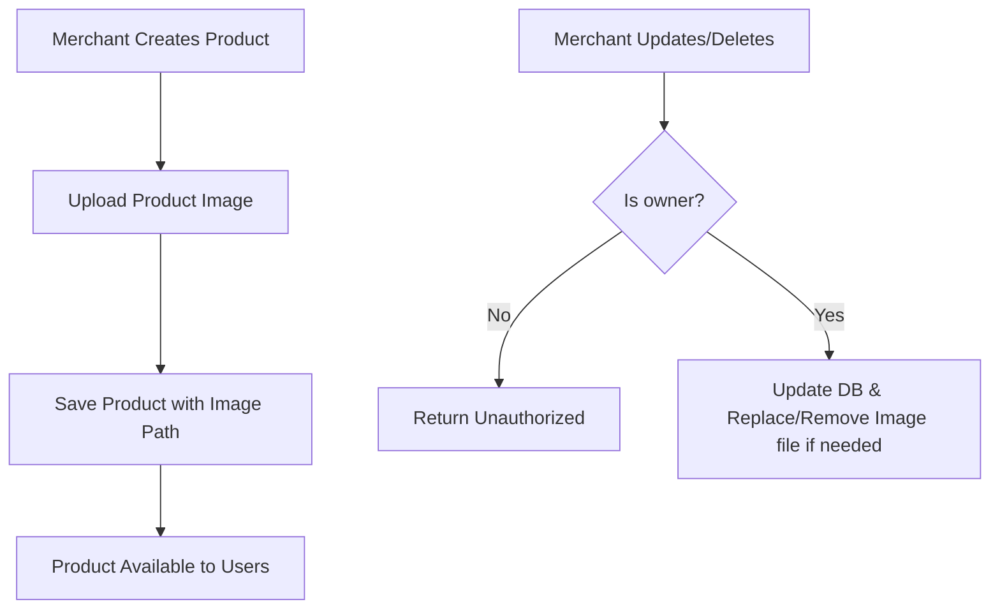

# Product Module — API Documentation

> **Base Path:** `/product`
> **Source:** [`src/app/module/product`](file:///C:/Users/thakursaad/projects/happyphoto/src/app/module/product)

---

## Table of Contents

- [Overview](#overview)
- [Product Flows](#product-flows)
- [Routes](#routes)
  - [POST /product/post-product](#1-post-productpost-product)
  - [GET /product/get-product](#2-get-productget-product)
  - [GET /product/get-all-products](#3-get-productget-all-products)
  - [PATCH /product/update-product](#4-patch-productupdate-product)
  - [DELETE /product/delete-product](#5-delete-productdelete-product)
- [Error Reference](#error-reference)
- [Background Jobs](#background-jobs)

---

## Overview

The Product module handles all operations related to merchants' products (specifically food products in this context). This includes product creation with image upload, retrieving individual products or a paginated list, and allowing merchants to update or delete their own products.

**Supported Roles for operations:** `MERCHANT` (mutations), `ALL` authenticated users (queries).

---

## Product Flows



---

## Routes

---

### 1. POST `/product/post-product`

Creates a new product for the authenticated merchant and uploads its image.

| Property       | Value                                       |
| -------------- | ------------------------------------------- |
| **Auth**       | ✅ **Required** — Bearer Token (`MERCHANT`) |
| **Rate Limit** | No                                          |

#### Request Body (`multipart/form-data`)

| Field           | Type   | Required | Description                                     |
| --------------- | ------ | -------- | ----------------------------------------------- |
| `name`          | string | ✅       | Name of the product                             |
| `category`      | string | ✅       | Product category                                |
| `price`         | number | ✅       | Product price                                   |
| `quantity`      | number | ✅       | Available stock quantity                        |
| `description`   | string | ✅       | Description of the product                      |
| `product_image` | file   | ✅       | Product image file (processed by file uploader) |

#### Response — Success

```json
{
  "statusCode": 200,
  "success": true,
  "message": "Product created",
  "data": {
    "_id": "ObjectId",
    "merchant": "ObjectId",
    "name": "Burger",
    "product_image": "uploads/images/xyz.jpg",
    "category": "Fast Food",
    "price": 10.99,
    "quantity": 100,
    "description": "Delicious burger",
    "isAvailable": true,
    "status": "active",
    "createdAt": "2023-10-01T00:00:00.000Z",
    "updatedAt": "2023-10-01T00:00:00.000Z"
  }
}
```

<!-- source: src/app/module/product/product.controller.ts#L6 -->
<!-- source: src/app/module/product/product.service.ts#L9 -->

#### Errors

| Status | Condition                 |
| ------ | ------------------------- |
| 400    | Missing required fields   |
| 400    | Product image is required |

---

### 2. GET `/product/get-product`

Retrieves a single product by its ID.

| Property       | Value                                  |
| -------------- | -------------------------------------- |
| **Auth**       | ✅ **Required** — Bearer Token (`ALL`) |
| **Rate Limit** | No                                     |

#### Query Parameters

| Field       | Type   | Required | Description           |
| ----------- | ------ | -------- | --------------------- |
| `productId` | string | ✅       | The ID of the product |

#### Response — Success

```json
{
  "statusCode": 200,
  "success": true,
  "message": "Product retrieved",
  "data": {
    "_id": "ObjectId",
    "merchant": "ObjectId",
    "name": "Burger",
    "product_image": "uploads/images/xyz.jpg",
    "category": "Fast Food",
    "price": 10.99,
    "quantity": 100,
    "description": "Delicious burger",
    "isAvailable": true,
    "status": "active",
    "createdAt": "2023-10-01T00:00:00.000Z",
    "updatedAt": "2023-10-01T00:00:00.000Z"
  }
}
```

<!-- source: src/app/module/product/product.controller.ts#L17 -->
<!-- source: src/app/module/product/product.service.ts#L38 -->

#### Errors

| Status | Condition         |
| ------ | ----------------- |
| 400    | Missing productId |
| 404    | Product not found |

---

### 3. GET `/product/get-all-products`

Retrieves a paginated list of products. Supports search, filtering, and sorting.

| Property       | Value                                  |
| -------------- | -------------------------------------- |
| **Auth**       | ✅ **Required** — Bearer Token (`ALL`) |
| **Rate Limit** | No                                     |

#### Query Parameters

Supports standard pagination, sorting, and filtering as defined in [`docs/api/_shared.md`](file:///C:/Users/thakursaad/projects/happyphoto/docs/api/_shared.md).

- **Searchable fields:** `name`, `category`, `description`

#### Response — Success

```json
{
  "statusCode": 200,
  "success": true,
  "message": "Products retrieved",
  "data": {
    "meta": {
      "page": 1,
      "limit": 10,
      "total": 50,
      "totalPages": 5
    },
    "products": [
      {
        "_id": "ObjectId",
        "merchant": "ObjectId",
        "name": "Burger",
        "product_image": "uploads/images/xyz.jpg",
        "category": "Fast Food",
        "price": 10.99,
        "quantity": 100,
        "description": "Delicious burger",
        "isAvailable": true,
        "status": "active",
        "createdAt": "2023-10-01T00:00:00.000Z",
        "updatedAt": "2023-10-01T00:00:00.000Z"
      }
    ]
  }
}
```

<!-- source: src/app/module/product/product.controller.ts#L28 -->
<!-- source: src/app/module/product/product.service.ts#L52 -->

---

### 4. PATCH `/product/update-product`

Updates an existing product. Only the merchant who owns the product can update it. Can also optionally replace the product image.

| Property       | Value                                       |
| -------------- | ------------------------------------------- |
| **Auth**       | ✅ **Required** — Bearer Token (`MERCHANT`) |
| **Rate Limit** | No                                          |

#### Request Body (`multipart/form-data`)

| Field           | Type   | Required | Description                                       |
| --------------- | ------ | -------- | ------------------------------------------------- |
| `productId`     | string | ✅       | ID of the product to update                       |
| `name`          | string | ❌       | Name of the product                               |
| `category`      | string | ❌       | Product category                                  |
| `price`         | number | ❌       | Product price                                     |
| `quantity`      | number | ❌       | Available stock quantity                          |
| `description`   | string | ❌       | Description of the product                        |
| `product_image` | file   | ❌       | New product image file (replaces old if provided) |

#### Response — Success

```json
{
  "statusCode": 200,
  "success": true,
  "message": "Product updated",
  "data": {
    "_id": "ObjectId",
    "merchant": "ObjectId",
    "name": "Burger",
    "product_image": "uploads/images/new_xyz.jpg",
    "category": "Fast Food",
    "price": 12.99,
    "quantity": 100,
    "description": "Delicious burger updated",
    "isAvailable": true,
    "status": "active",
    "createdAt": "2023-10-01T00:00:00.000Z",
    "updatedAt": "2023-10-05T00:00:00.000Z"
  }
}
```

<!-- source: src/app/module/product/product.controller.ts#L39 -->
<!-- source: src/app/module/product/product.service.ts#L71 -->

#### Errors

| Status | Condition                                     |
| ------ | --------------------------------------------- |
| 400    | Missing productId                             |
| 404    | Product not found                             |
| 401    | You are not authorized to update this product |

---

### 5. DELETE `/product/delete-product`

Deletes an existing product and removes its associated image file from storage. Only the merchant who owns the product can delete it.

| Property       | Value                                       |
| -------------- | ------------------------------------------- |
| **Auth**       | ✅ **Required** — Bearer Token (`MERCHANT`) |
| **Rate Limit** | No                                          |

#### Request Body (`application/json`)

```json
{
  "productId": "ObjectId"
}
```

| Field       | Type   | Required | Description                 |
| ----------- | ------ | -------- | --------------------------- |
| `productId` | string | ✅       | ID of the product to delete |

#### Response — Success

```json
{
  "statusCode": 200,
  "success": true,
  "message": "Product deleted",
  "data": {
    "acknowledged": true,
    "deletedCount": 1
  }
}
```

<!-- source: src/app/module/product/product.controller.ts#L50 -->
<!-- source: src/app/module/product/product.service.ts#L118 -->

#### Errors

| Status | Condition                                     |
| ------ | --------------------------------------------- |
| 400    | Missing productId                             |
| 404    | Product not found                             |
| 401    | You are not authorized to delete this product |

---

## Error Reference

All error responses follow the standard API error envelope defined in [`docs/api/_shared.md`](file:///C:/Users/thakursaad/projects/happyphoto/docs/api/_shared.md).

| HTTP Status | Meaning                                            |
| ----------- | -------------------------------------------------- |
| 400         | Bad Request — validation failed or incorrect input |
| 401         | Unauthorized — token invalid or not authorized     |
| 404         | Not Found — product doesn't exist                  |

---

## Background Jobs

There are no background jobs specifically tied to the Product module at this time.
