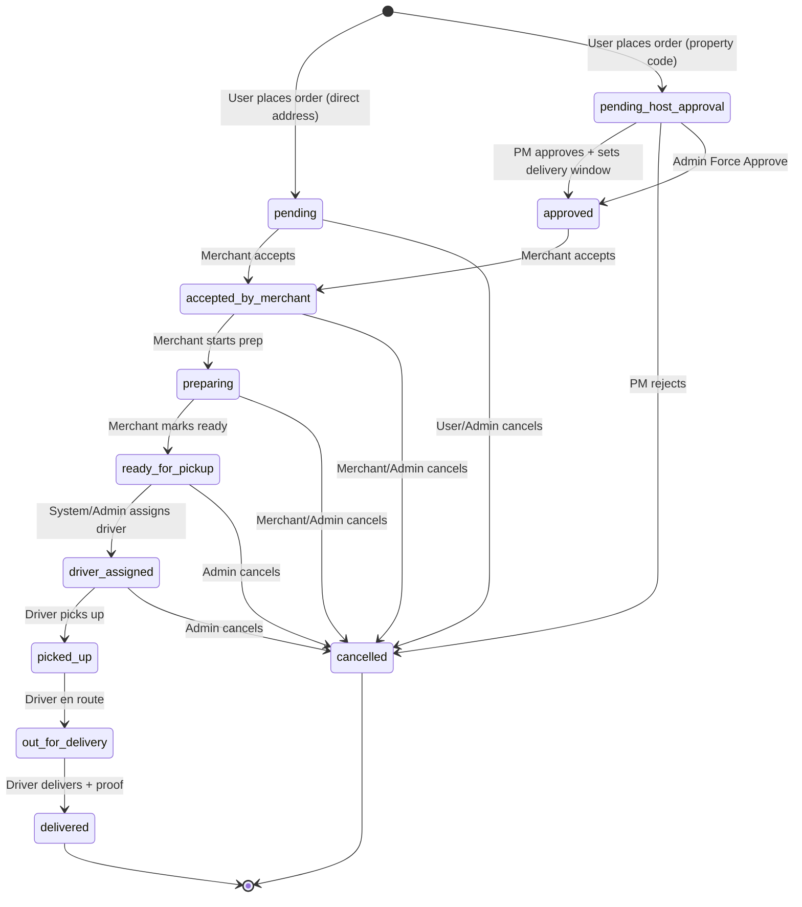

# Fridge Fillers (Happypphoto) — Full Implementation Plan v2

> **Generated**: 2026-06-27 | **Revised**: 2026-07-01  
> **Backend Stack**: Node.js · Express 5 · TypeScript · Mongoose · MongoDB  
> **Real-Time**: Socket.IO (chat + driver location only)  
> **Payments**: Stripe Card (customer) · Stripe Connect (merchant/driver payouts)

---

## What Changed From v1

- **Design System**: Fully re-derived from 86 real screen images. The guessed pink `#b26a7b` brand color was wrong — the actual UI uses a **green (#2E7D32) + light cyan (#E8F5F5) + white** palette. Typography, spacing, and component library now reflect the real screens.
- **Screen Inventory**: All Figma-guessed screen breakdowns replaced with verified image evidence (18 customer, 20 property-host, 20 dasher, 17 merchant-dashboard, 11 admin-dashboard = 86 total).
- **Payment**: Stripped all generic "payment gateway abstraction." Customer pays via **Stripe Card only** (confirmed from Payment Methods screens showing only Stripe + Visa, no wallets/COD). Payouts via **Stripe Connect with separate charges and transfers** — was listed as P3 "nice-to-have," now promoted to **P0** since the Revenue screen shows a "Platform Fee (15%)" column and "Withdraw Funds" button that require Connect.
- **15% Platform Commission**: Discovered from merchant Revenue screen — the column header explicitly reads "Platform Fee (15%)." This was absent from v1.
- **Order Lifecycle**: Replaced speculative states with image-evidenced ones. Added `out_for_delivery` (confirmed across 3 roles). Removed `in_transit` as redundant — images show "Out for Delivery" everywhere, never "In Transit."
- **Driver/Dasher/Chopper/Shopper Unification**: Explicitly documented — 4 display labels, 1 backend enum (`DRIVER`). Screens show "Shopper Application," "Shopper Portal," "Dasher Portal" interchangeably.
- **Driver Onboarding**: Discovered 4-step application wizard (Personal Info → Vehicle Details → Documents → Review) with admin approval flow. v1 only had document upload.
- **Merchant Onboarding**: Discovered 7-step wizard (Account Setup → Business Info → Location → Store Setup → Documents → Payment → Review & Submit) with 24-48hr admin review SLA.
- **Property Host**: Fully validated against `Property_host_role.md` — zero mismatches. Added **Delivery Rules** (guest stay duration with auto-block), **delivery window scheduling** (2-step approval), and **property type** field from images.
- **Admin Dashboard**: Full sidebar with 4 groups (Overview, Management, Ecosystem, System) and 11 screens mapped. Added **Delivery Requests** (Force Approve), **Properties & Codes** (Flagged Properties), **Payments & Financials**.
- **Merchant Dashboard**: Store Open/Close toggle, Low Stock Alerts, Delivery Status tracking with dasher vehicle info — all new from images.
- **Payout Model**: New `Payout` model for merchant/driver withdrawal requests with admin approval workflow.
- **StoreSettings fields**: Business Hours (per-day), Delivery Radius, Minimum Order amount, Prep Time — discovered from merchant Settings screen.
- **Socket.IO scope unchanged**: Confirmed — chat + driver location only. No changes needed.
- **Removed**: Social login (Google/Apple) — auth screens excluded per instructions, no image evidence. Remains possible future addition.
- **Sprint plan restructured**: Stripe Connect moved from Sprint 4 to Sprint 1. Payout flow added to Sprint 2. Total timeline unchanged at 8 weeks.

---

## 0. PROPERTY_HOST Role — Verified Understanding

Based on [Property_host_role.md](file:///C:/Users/thakursaad/projects/happyphoto/docs/Property_host_role.md) **and confirmed across all 20 property-host screen images**:

The **PROPERTY_HOST** (referred to as "Property Manager" or "PM" in the doc) is a **short-term rental host** (e.g., Airbnb/VRBO host) who acts as a **gatekeeper** between their guest (the customer) and the delivery service. The defining workflow is:

1. **Property Setup** — PM registers, adds their rental property's **physical address** with property type (Apartment/Vacation Rental/House) and images. The system generates a **unique property code** (format: 3 uppercase letters + 4 digits, e.g., `PHX2847`) for that address. The PM shares this code with their guest **outside the platform** (via Airbnb/VRBO messaging). Code is copyable and shareable from the app.

2. **Customer Ordering** — The guest enters the Property Code in the checkout address step (toggle between "My Address" and "Property Code" tabs). The system resolves the code to show property name + host company (e.g., "Downtown Loft / Managed by Sunset Rentals") but **never the physical address**. The guest browses stores, builds a cart, and places an order. The order goes into **"Pending Host Approval"** — it does NOT immediately route to a merchant or driver.

3. **PM Approval** — The PM receives a notification. They review the order (customer, store, items, total) and go through a **2-step approval**: (a) Set **Delivery Window** (date + start/end time), then (b) Set **Guest Stay Duration** (check-in/check-out dates). Orders outside the guest stay period are **automatically blocked** by the system. PM taps "Approve & Save."

4. **Fulfillment** — Only after PM approval does the order become visible to the Driver. **Only at this point** is the physical address revealed to the driver for navigation ("Address revealed to driver only at pickup" — confirmed from success screen). The driver delivers within the PM's specified window.

**Key principles (all image-confirmed):**

- Physical address is **never exposed** to the customer or driver until PM approval
- The Property Code is the **only identifier** the customer uses
- Each code is **permanent** and tied to one specific address
- PM controls **when** deliveries happen via delivery window + guest stay dates
- Properties have **Delivery Rules** (window + stay dates) that persist across orders
- One host can manage **multiple properties** (Dashboard shows count: e.g., "Properties: 04")

---

## 1. Project Overview

### 1.1 Platform Description

Fridge Fillers is a **multivendor food/grocery delivery platform** targeting the **short-term rental market**. What makes it unique is the PROPERTY_HOST role: rental hosts can register their properties, generate privacy-preserving codes, and control delivery schedules to their rental units — keeping their physical addresses private until the moment of delivery.

**App branding**: "Fridge Fillers" with green logo. Version 2.4.1 (from Help & Support screens).

### 1.2 Confirmed Tech Stack (from codebase)

| Layer         | Technology                  | Version   |
| ------------- | --------------------------- | --------- |
| Runtime       | Node.js                     | —         |
| Language      | TypeScript                  | 6.x       |
| Framework     | Express.js                  | 5.2.x     |
| Database      | MongoDB                     | —         |
| ODM           | Mongoose                    | 9.3.x     |
| Auth          | JWT (jsonwebtoken) + bcrypt | 9.x / 6.x |
| Real-Time     | Socket.IO                   | 4.8.x     |
| Payments      | Stripe                      | 20.x      |
| Email         | Nodemailer                  | 8.x       |
| File Upload   | Multer                      | 2.x       |
| Logging       | Winston + Daily Rotate File | 3.x / 5.x |
| Cron          | node-cron                   | 4.x       |
| Validation    | validator.js                | 13.x      |
| Rate Limiting | express-rate-limit          | 8.x       |
| Templating    | EJS                         | 5.x       |

### 1.3 Roles & Core Responsibilities

| Role              | Backend Enum    | Display Labels                 | Responsibility                                                                                                                                                                                                                                                                                                                                                                                          |
| ----------------- | --------------- | ------------------------------ | ------------------------------------------------------------------------------------------------------------------------------------------------------------------------------------------------------------------------------------------------------------------------------------------------------------------------------------------------------------------------------------------------------- |
| **USER**          | `USER`          | "Customer"                     | End consumer / rental guest. Browses stores, adds items to cart, enters Property Code or own address, places orders, tracks delivery with live map, rates orders, chats with drivers.                                                                                                                                                                                                                   |
| **PROPERTY_HOST** | `PROPERTY_HOST` | "Host", "PM"                   | Short-term rental host. Registers properties with physical addresses, generates unique property codes, shares codes with guests, reviews/approves delivery requests with delivery windows and guest stay dates, manages delivery rules.                                                                                                                                                                 |
| **DRIVER**        | `DRIVER`        | "Dasher", "Chopper", "Shopper" | Delivery agent. Applies with vehicle + documents, gets admin-approved, goes online/offline, accepts/declines delivery requests with visible payout, picks up from merchant, delivers with proof, broadcasts live location, withdraws earnings to bank.                                                                                                                                                  |
| **MERCHANT**      | `MERCHANT`      | "Merchant Admin"               | Store/restaurant owner. Onboards via 7-step wizard, manages store profile + business hours + delivery settings, creates/updates product catalog + inventory, receives and fulfills orders, tracks active deliveries with driver info, withdraws revenue minus 15% platform fee.                                                                                                                         |
| **ADMIN**         | `ADMIN`         | "System Admin", "Super User"   | Platform administrator. Dashboard with real-time metrics across all 4 user types, manages users (approve/block/suspend), monitors properties & codes, manages orders & delivery requests (Force Approve), manages stores & merchants, fleet management (drivers & logistics), payment & financial oversight with CSV export, reports & analytics, system settings (T&C, Privacy Policy), notifications. |

### 1.4 Driver Label Unification

> **IMPORTANT**: `DRIVER`, "Dasher", "Chopper", and "Shopper" are all **display labels** for the single `DRIVER` role. The backend enum is `DRIVER`. No separate logic, models, endpoints, or permissions exist for these labels. The onboarding screens use "Shopper Application" / "Shopper Portal" while the post-approval screens use "Dasher Portal." This is cosmetic only.

---

## 2. Design System & UI Tokens

> **Re-derived from 86 real screen images** — replaces all v1 guesses.

### 2.1 Color Palette (from real screens)

| Token                     | Value                 | Usage                                                  | Source                                                    |
| ------------------------- | --------------------- | ------------------------------------------------------ | --------------------------------------------------------- |
| Primary                   | `#2E7D32`             | Main brand color, buttons, active nav, toggles, badges | All screens — green buttons, nav items, Store Open toggle |
| Primary Dark              | `#1B5E20`             | Hover states, header backgrounds                       | Dasher earnings header, merchant sidebar active           |
| Primary Light             | `#E8F5E9`             | Success backgrounds, subtle highlights                 | Approval badges, low-stock tag backgrounds                |
| Background                | `#E8F5F5` / `#F0F9F9` | Page background (mobile screens)                       | All customer/driver/host mobile screens use light cyan    |
| Background (Dashboard)    | `#FAFAFA` / `#FFFFFF` | Page background (web dashboards)                       | Merchant + Admin dashboards use off-white/white           |
| Surface                   | `#FFFFFF`             | Cards, form containers, modals                         | All card components                                       |
| Text Primary              | `#1A1A2E` / `#212121` | Headings, body text                                    | —                                                         |
| Text Secondary            | `#757575`             | Subtitles, metadata, timestamps                        | —                                                         |
| Success                   | `#2E7D32`             | Delivered, Approved, Active, Paid, In Stock            | Status badges across all roles                            |
| Warning                   | `#F57C00` / `#FFC107` | Pending states, Low Stock                              | Pending badges, low stock indicators                      |
| Error / Danger            | `#D32F2F`             | Cancelled, Remove, Out of Stock, Flagged               | Status badges, delete/remove actions                      |
| Info / Blue               | `#1976D2`             | Preparing, Out for Delivery, informational             | Order status badges in merchant/admin                     |
| Purple                    | `#7B1FA2`             | Preparing status in merchant dashboard                 | Merchant Recent Orders "Preparing" badge                  |
| Sidebar Active (Admin)    | `#E3F2FD`             | Admin sidebar active item background                   | Admin Panel screens                                       |
| Sidebar Active (Merchant) | `#E8F5E9`             | Merchant sidebar active item background                | Merchant Panel screens                                    |

### 2.2 Typography (from real screens)

| Level         | Font Family             | Weight                | Approximate Size | Usage                                           |
| ------------- | ----------------------- | --------------------- | ---------------- | ----------------------------------------------- |
| H1            | System (SF Pro / Inter) | Bold (700)            | 28-32px          | Page titles ("Earnings", "My Properties")       |
| H2            | System                  | Semi-Bold (600)       | 22-24px          | Section headers ("Breakdown", "Payout History") |
| H3            | System                  | Semi-Bold (600)       | 18-20px          | Card titles, sub-headers                        |
| Body          | System                  | Regular (400)         | 14-16px          | General content, descriptions                   |
| Caption       | System                  | Regular (400)         | 12px             | Timestamps, metadata, helper text               |
| Button        | System                  | Medium-Bold (500-700) | 16px             | All action buttons                              |
| Stats/Numbers | System                  | Bold (700)            | 36-48px          | Dashboard stat values ("$534.93", "24")         |
| Nav Label     | System                  | Medium (500)          | 11-12px          | Bottom nav labels                               |

### 2.3 Component Library (confirmed from images)

| Component                 | Variants                                                                                                                                                           | Used By                          |
| ------------------------- | ------------------------------------------------------------------------------------------------------------------------------------------------------------------ | -------------------------------- |
| **Bottom Navigation**     | 4-tab (Dashboard/Orders/Earnings/Profile for Driver), 5-tab (Home/Stores/Orders/Cart/Profile for Customer), 4-tab (Dashboard/Properties/Requests/Profile for Host) | Mobile apps                      |
| **Sidebar Navigation**    | Collapsible with icon + label, grouped sections, active highlight, logout at bottom                                                                                | Merchant + Admin dashboards      |
| **Stat Cards**            | Icon + value + label, colored border variants                                                                                                                      | All dashboards                   |
| **Order Status Badge**    | Pill shape with role-appropriate colors (New/Preparing/Ready/Delivering/Completed/Cancelled)                                                                       | All roles                        |
| **Data Table**            | Header row + body rows, action column, search + filter, status badges                                                                                              | Merchant + Admin dashboards      |
| **Filter Tabs/Chips**     | Horizontal scrollable, active state fill                                                                                                                           | Orders list, category filters    |
| **Form Stepper**          | Vertical (merchant/host onboarding), horizontal (checkout) with connected line, step icons                                                                         | Onboarding + checkout            |
| **Property Code Display** | Code text + copy icon + share icon, green branded                                                                                                                  | Host property detail + creation  |
| **Store Open Toggle**     | Green switch in header bar                                                                                                                                         | Merchant dashboard               |
| **Map View**              | Google Maps with pin markers, progress bar (Store to Customer)                                                                                                     | Driver tracking, delivery status |
| **Chat Interface**        | Message bubbles (sent/received), timestamp, avatar, text input                                                                                                     | Customer-Driver chat             |
| **Earnings Chart**        | Weekly bar chart (W1-W4), metric cards below                                                                                                                       | Driver earnings                  |
| **Quick Amount Buttons**  | $50 / $100 / $150 / All pill buttons                                                                                                                               | Withdrawal amount selection      |

---

## 3. Database Schema

### 3.1 Existing Models (verified from codebase)

#### 3.1.1 Auth (`auths`)

| Field                    | Type     | Required | Default | Constraints                                        | Notes                      |
| ------------------------ | -------- | -------- | ------- | -------------------------------------------------- | -------------------------- |
| `_id`                    | ObjectId | auto     | —       | —                                                  | —                          |
| `name`                   | String   | ✅       | —       | —                                                  | —                          |
| `email`                  | String   | ✅       | —       | unique, validator.isEmail                          | —                          |
| `password`               | String   | ✅       | —       | `select: false`                                    | bcrypt-hashed via pre-save |
| `role`                   | String   | ✅       | —       | enum: USER, PROPERTY_HOST, DRIVER, MERCHANT, ADMIN | —                          |
| `isVerified`             | Boolean  | ❌       | —       | —                                                  | For password reset flow    |
| `isBlocked`              | Boolean  | ❌       | `false` | —                                                  | Admin can block users      |
| `isActive`               | Boolean  | ❌       | `false` | —                                                  | Activated after OTP        |
| `verificationCode`       | String   | ❌       | —       | —                                                  | Password reset OTP         |
| `verificationCodeExpire` | Date     | ❌       | —       | —                                                  | —                          |
| `activationCode`         | String   | ❌       | —       | —                                                  | Signup activation OTP      |
| `activationCodeExpire`   | Date     | ❌       | —       | —                                                  | —                          |
| `createdAt`              | Date     | auto     | —       | —                                                  | timestamps                 |
| `updatedAt`              | Date     | auto     | —       | —                                                  | timestamps                 |

**Statics**: `isAuthExist(email)`, `isPasswordMatched(given, saved)`  
**Pre-save Hook**: Hashes password on modification

#### 3.1.2 User (`users`) — Polymorphic "God Model"

> **SCHEMA CONCERN**: Currently holds fields for ALL non-admin roles (USER, PROPERTY_HOST, DRIVER, MERCHANT) in a single collection. While this simplifies queries, it creates a sparse document problem. Recommended to keep for now (no over-engineering) but add role-specific validation.

| Field                        | Type          | Required | Default      | Role-Specific    | Ref                                                                 |
| ---------------------------- | ------------- | -------- | ------------ | ---------------- | ------------------------------------------------------------------- |
| `authId`                     | ObjectId      | ✅       | —            | All              | Auth                                                                |
| `name`                       | String        | ✅       | —            | All              | —                                                                   |
| `email`                      | String        | ✅       | —            | All              | —                                                                   |
| `role`                       | String        | ✅       | —            | All (enum)       | —                                                                   |
| `profile_image`              | String        | ❌       | —            | All              | —                                                                   |
| `phoneNumber`                | String        | ❌       | —            | All              | —                                                                   |
| `dateOfBirth`                | String        | ❌       | —            | All              | —                                                                   |
| `address`                    | String        | ❌       | —            | All              | —                                                                   |
| `isOnline`                   | Boolean       | ❌       | `false`      | All (Socket)     | —                                                                   |
| `businessName`               | String        | ❌       | —            | PROPERTY_HOST    | —                                                                   |
| `taxId`                      | String        | ❌       | —            | PROPERTY_HOST    | EIN / Tax ID (from Business Details screen)                         |
| `businessAddress`            | String        | ❌       | —            | PROPERTY_HOST    | Business address (from Business Details screen)                     |
| `isApproved`                 | Boolean       | ❌       | —            | DRIVER, MERCHANT | Admin approval flag                                                 |
| `applicationStatus`          | String        | ❌       | `"pending"`  | DRIVER, MERCHANT | enum: pending, approved, rejected                                   |
| `vehicleType`                | String        | ❌       | —            | DRIVER           | enum: bicycle, scooter, car (from Vehicle screen)                   |
| `licenseNumber`              | String        | ❌       | —            | DRIVER           | —                                                                   |
| `plateNumber`                | String        | ❌       | —            | DRIVER           | —                                                                   |
| `drivingLicense_image`       | String        | ❌       | —            | DRIVER           | —                                                                   |
| `idCard_image`               | String        | ❌       | —            | DRIVER           | —                                                                   |
| `vehicleRegistration_image`  | String        | ❌       | —            | DRIVER           | —                                                                   |
| `locationCoordinates`        | GeoJSON Point | ❌       | type="Point" | DRIVER           | —                                                                   |
| `averageRating`              | Number        | ❌       | `0`          | DRIVER, MERCHANT | Denormalized from reviews                                           |
| `totalReviews`               | Number        | ❌       | `0`          | DRIVER, MERCHANT | —                                                                   |
| `totalDeliveries`            | Number        | ❌       | `0`          | DRIVER           | Denormalized counter                                                |
| `stripeConnectAccountId`     | String        | ❌       | —            | DRIVER, MERCHANT | Stripe Connect account ID                                           |
| `stripeConnectOnboarded`     | Boolean       | ❌       | `false`      | DRIVER, MERCHANT | Connect onboarding complete                                         |
| `storeName`                  | String        | ❌       | —            | MERCHANT         | —                                                                   |
| `businessType`               | String        | ❌       | —            | MERCHANT         | —                                                                   |
| `businessRegistrationNumber` | String        | ❌       | —            | MERCHANT         | —                                                                   |
| `vatNumber`                  | String        | ❌       | —            | MERCHANT         | —                                                                   |
| `storeLocationCoordinates`   | GeoJSON Point | ❌       | type="Point" | MERCHANT         | —                                                                   |
| `storeAddress`               | String        | ❌       | —            | MERCHANT         | —                                                                   |
| `storeCity`                  | String        | ❌       | —            | MERCHANT         | —                                                                   |
| `storeState`                 | String        | ❌       | —            | MERCHANT         | —                                                                   |
| `storePostalCode`            | String        | ❌       | —            | MERCHANT         | —                                                                   |
| `storeCountry`               | String        | ❌       | —            | MERCHANT         | —                                                                   |
| `storeDescription`           | String        | ❌       | —            | MERCHANT         | —                                                                   |
| `storeOpeningTime`           | String        | ❌       | —            | MERCHANT         | —                                                                   |
| `storeClosingTime`           | String        | ❌       | —            | MERCHANT         | —                                                                   |
| `storeAveragePrepTime`       | Number        | ❌       | —            | MERCHANT         | Minutes                                                             |
| `storePhoneNumber`           | String        | ❌       | —            | MERCHANT         | From Store Settings screen                                          |
| `storeSupportEmail`          | String        | ❌       | —            | MERCHANT         | From Store Settings screen                                          |
| `storeDeliveryRadius`        | Number        | ❌       | —            | MERCHANT         | Miles (from Settings screen)                                        |
| `storeMinimumOrder`          | Number        | ❌       | —            | MERCHANT         | Dollars (from Settings screen)                                      |
| `storeIsOpen`                | Boolean       | ❌       | `true`       | MERCHANT         | Store Open/Close toggle                                             |
| `store_logo`                 | String        | ❌       | —            | MERCHANT         | —                                                                   |
| `store_banner_image`         | String        | ❌       | —            | MERCHANT         | —                                                                   |
| `store_front_image`          | String        | ❌       | —            | MERCHANT         | —                                                                   |
| `trade_license_document`     | String        | ❌       | —            | MERCHANT         | —                                                                   |
| `merchant_id_card_image`     | String        | ❌       | —            | MERCHANT         | —                                                                   |
| `businessHours`              | Mixed         | ❌       | —            | MERCHANT         | `{ monday: { open: String, close: String, isOpen: Boolean }, ... }` |

**Recommended Indexes**: `{ authId: 1 }`, `{ email: 1 }`, `{ role: 1 }`, `{ locationCoordinates: "2dsphere" }`, `{ storeLocationCoordinates: "2dsphere" }`

#### 3.1.3 Admin (`admins`)

| Field           | Type     | Required | Ref  |
| --------------- | -------- | -------- | ---- |
| `authId`        | ObjectId | ✅       | Auth |
| `name`          | String   | ✅       | —    |
| `email`         | String   | ✅       | —    |
| `profile_image` | String   | ❌       | —    |
| `phoneNumber`   | String   | ❌       | —    |
| `address`       | String   | ❌       | —    |

#### 3.1.4 Product (`products`)

| Field           | Type     | Required | Ref  |
| --------------- | -------- | -------- | ---- |
| `merchant`      | ObjectId | ✅       | User |
| `name`          | String   | ✅       | —    |
| `product_image` | String   | ✅       | —    |
| `category`      | String   | ✅       | —    |
| `price`         | Number   | ✅       | —    |
| `quantity`      | Number   | ✅       | —    |
| `description`   | String   | ✅       | —    |

**Recommended Indexes**: `{ merchant: 1 }`, `{ category: 1 }`, `{ name: "text", description: "text" }`

#### 3.1.5 Chat (`chats`)

| Field          | Type       | Required | Ref     |
| -------------- | ---------- | -------- | ------- |
| `participants` | [ObjectId] | ✅       | User    |
| `messages`     | [ObjectId] | ✅       | Message |

#### 3.1.6 Message (`messages`)

| Field      | Type     | Required | Default |
| ---------- | -------- | -------- | ------- |
| `sender`   | ObjectId | ✅       | —       |
| `receiver` | ObjectId | ✅       | —       |
| `message`  | String   | ✅       | —       |
| `isRead`   | Boolean  | ❌       | `false` |

#### 3.1.7 Feedback (`feedbacks`)

| Field      | Type     | Required | Ref  |
| ---------- | -------- | -------- | ---- |
| `user`     | ObjectId | ❌       | User |
| `name`     | String   | ✅       | —    |
| `email`    | String   | ✅       | —    |
| `feedback` | String   | ✅       | —    |
| `reply`    | String   | ❌       | —    |

#### 3.1.8 Review (`reviews`)

| Field    | Type     | Required | Validation     |
| -------- | -------- | -------- | -------------- |
| `user`   | ObjectId | ✅       | Ref: User      |
| `rating` | Number   | ✅       | min: 1, max: 5 |
| `review` | String   | ✅       | —              |

#### 3.1.9 Notification (`notifications`) & AdminNotification (`adminnotifications`)

**Notification**: `toId` (ObjectId, required), `title`, `message`, `isRead` (default false)  
**AdminNotification**: `title`, `message`, `isRead` (default false) — no `toId`

#### 3.1.10 Content Models (Singleton Pattern)

All share the same schema `{ description: String (required) }`:

- `TermsConditions`, `PrivacyPolicy`, `FAQ`, `AboutUs`, `ContactUs`

### 3.2 NEW Models Required

#### 3.2.1 Property (`properties`)

| Field                 | Type          | Required | Default      | Constraints                                           | Notes                                                          |
| --------------------- | ------------- | -------- | ------------ | ----------------------------------------------------- | -------------------------------------------------------------- |
| `_id`                 | ObjectId      | auto     | —            | —                                                     | —                                                              |
| `hostId`              | ObjectId      | ✅       | —            | ref: User                                             | The PROPERTY_HOST user                                         |
| `propertyName`        | String        | ✅       | —            | —                                                     | Display name (e.g., "Downtown Loft")                           |
| `propertyType`        | String        | ✅       | —            | enum: apartment, vacation_rental, house, condo, other | From Add Property screen dropdown                              |
| `physicalAddress`     | String        | ✅       | —            | —                                                     | Full street address — **PRIVATE**                              |
| `city`                | String        | ✅       | —            | —                                                     | —                                                              |
| `state`               | String        | ❌       | —            | —                                                     | —                                                              |
| `postalCode`          | String        | ✅       | —            | —                                                     | —                                                              |
| `country`             | String        | ✅       | —            | —                                                     | —                                                              |
| `propertyCode`        | String        | ✅       | —            | unique                                                | System-generated (format: 3 letters + 4 digits, e.g., PHX2847) |
| `locationCoordinates` | GeoJSON Point | ❌       | type="Point" | 2dsphere index                                        | For geo-queries                                                |
| `isActive`            | Boolean       | ❌       | `true`       | —                                                     | PM can deactivate                                              |
| `isFlagged`           | Boolean       | ❌       | `false`      | —                                                     | Admin can flag for investigation                               |
| `propertyImage`       | String        | ❌       | —            | —                                                     | Optional photo                                                 |
| `deliveryRules`       | Object        | ❌       | —            | —                                                     | Persistent rules (see below)                                   |
| `guestStayDates`      | Object        | ❌       | —            | —                                                     | `{ checkIn: Date, checkOut: Date }`                            |

**deliveryRules subdocument**:

```
{
  defaultWindowStart: String,  // e.g., "14:00"
  defaultWindowEnd: String,    // e.g., "16:00"
  guestStayCheckIn: Date,
  guestStayCheckOut: Date
}
```

**Indexes**: `{ propertyCode: 1, unique: true }`, `{ hostId: 1 }`, `{ locationCoordinates: "2dsphere" }`, `{ isActive: 1 }`

#### 3.2.2 Order (`orders`)

| Field                   | Type          | Required | Default     | Notes                                              |
| ----------------------- | ------------- | -------- | ----------- | -------------------------------------------------- |
| `_id`                   | ObjectId      | auto     | —           | —                                                  |
| `orderId`               | String        | ✅       | —           | Human-readable (e.g., "ORD-1025")                  |
| `userId`                | ObjectId      | ✅       | —           | ref: User (the customer)                           |
| `merchantId`            | ObjectId      | ✅       | —           | ref: User (the merchant)                           |
| `driverId`              | ObjectId      | ❌       | —           | ref: User (assigned driver)                        |
| `propertyId`            | ObjectId      | ❌       | —           | ref: Property (if property-code order)             |
| `propertyHostId`        | ObjectId      | ❌       | —           | ref: User (the PM who must approve)                |
| `items`                 | [OrderItem]   | ✅       | —           | Embedded subdocument array                         |
| `status`                | String        | ✅       | `"pending"` | enum: see Order Lifecycle                          |
| `subtotal`              | Number        | ✅       | —           | Sum of item prices times quantities                |
| `deliveryFee`           | Number        | ✅       | `0`         | —                                                  |
| `serviceFee`            | Number        | ✅       | `0`         | Platform service fee (to customer)                 |
| `tax`                   | Number        | ✅       | `0`         | —                                                  |
| `total`                 | Number        | ✅       | —           | subtotal + deliveryFee + serviceFee + tax          |
| `platformCommission`    | Number        | ❌       | —           | 15% of subtotal — deducted from merchant payout    |
| `driverPayout`          | Number        | ❌       | —           | Driver earnings for this order                     |
| `merchantNetEarnings`   | Number        | ❌       | —           | subtotal minus platformCommission                  |
| `deliveryAddress`       | String        | ❌       | —           | Resolved from property code or direct input        |
| `deliveryCoordinates`   | GeoJSON Point | ❌       | —           | —                                                  |
| `deliveryWindow`        | Object        | ❌       | —           | `{ start: Date, end: Date }` — set by PM           |
| `stayDates`             | Object        | ❌       | —           | `{ checkIn: Date, checkOut: Date }` — set by PM    |
| `specialInstructions`   | String        | ❌       | —           | —                                                  |
| `promoCode`             | String        | ❌       | —           | Applied promo code                                 |
| `proofOfDelivery`       | String        | ❌       | —           | Image path                                         |
| `cancelReason`          | String        | ❌       | —           | —                                                  |
| `cancelledBy`           | String        | ❌       | —           | enum: USER, MERCHANT, DRIVER, ADMIN, PROPERTY_HOST |
| `paymentId`             | ObjectId      | ❌       | —           | ref: Payment                                       |
| `estimatedDeliveryTime` | Date          | ❌       | —           | —                                                  |
| `actualDeliveryTime`    | Date          | ❌       | —           | —                                                  |
| `pickedUpAt`            | Date          | ❌       | —           | —                                                  |
| `approvedAt`            | Date          | ❌       | —           | When PM approved                                   |
| `acceptedByMerchantAt`  | Date          | ❌       | —           | —                                                  |
| `acceptedByDriverAt`    | Date          | ❌       | —           | —                                                  |

**OrderItem Subdocument**:

| Field           | Type     | Required          |
| --------------- | -------- | ----------------- |
| `productId`     | ObjectId | ✅ (ref: Product) |
| `name`          | String   | ✅                |
| `price`         | Number   | ✅                |
| `quantity`      | Number   | ✅                |
| `product_image` | String   | ❌                |

**Indexes**: `{ userId: 1 }`, `{ merchantId: 1 }`, `{ driverId: 1 }`, `{ propertyHostId: 1 }`, `{ status: 1 }`, `{ orderId: 1, unique: true }`

#### 3.2.3 Cart (`carts`)

| Field          | Type       | Required | Default               |
| -------------- | ---------- | -------- | --------------------- |
| `_id`          | ObjectId   | auto     | —                     |
| `userId`       | ObjectId   | ✅       | — (ref: User, unique) |
| `items`        | [CartItem] | ✅       | `[]`                  |
| `propertyCode` | String     | ❌       | —                     |

**CartItem Subdocument**:

| Field        | Type     | Required          |
| ------------ | -------- | ----------------- |
| `productId`  | ObjectId | ✅ (ref: Product) |
| `merchantId` | ObjectId | ✅ (ref: User)    |
| `quantity`   | Number   | ✅ (min: 1)       |
| `price`      | Number   | ✅                |

**Index**: `{ userId: 1, unique: true }`

#### 3.2.4 Payment (`payments`)

| Field                   | Type     | Required | Default                                                                    |
| ----------------------- | -------- | -------- | -------------------------------------------------------------------------- |
| `_id`                   | ObjectId | auto     | —                                                                          |
| `orderId`               | ObjectId | ✅       | — (ref: Order)                                                             |
| `userId`                | ObjectId | ✅       | — (ref: User)                                                              |
| `stripePaymentIntentId` | String   | ✅       | —                                                                          |
| `stripeCustomerId`      | String   | ❌       | —                                                                          |
| `amount`                | Number   | ✅       | —                                                                          |
| `currency`              | String   | ✅       | `"usd"`                                                                    |
| `status`                | String   | ✅       | `"unpaid"` (enum: succeeded, unpaid, refunded, partially_refunded, failed) |
| `paymentMethod`         | String   | ❌       | —                                                                          |
| `refundId`              | String   | ❌       | —                                                                          |
| `refundAmount`          | Number   | ❌       | —                                                                          |
| `refundReason`          | String   | ❌       | —                                                                          |

**Index**: `{ orderId: 1 }`, `{ userId: 1 }`, `{ stripePaymentIntentId: 1 }`

#### 3.2.5 Payout (`payouts`) — Merchant & Driver Withdrawals

| Field              | Type     | Required | Default     | Notes                                                    |
| ------------------ | -------- | -------- | ----------- | -------------------------------------------------------- |
| `_id`              | ObjectId | auto     | —           | —                                                        |
| `userId`           | ObjectId | ✅       | —           | ref: User (MERCHANT or DRIVER)                           |
| `amount`           | Number   | ✅       | —           | Withdrawal amount                                        |
| `status`           | String   | ✅       | `"pending"` | enum: pending, approved, processing, completed, rejected |
| `type`             | String   | ✅       | —           | enum: weekly_payout, manual_withdrawal                   |
| `stripeTransferId` | String   | ❌       | —           | Stripe Transfer ID                                       |
| `bankAccountLast4` | String   | ❌       | —           | Last 4 digits of bank account                            |
| `adminApprovedBy`  | ObjectId | ❌       | —           | ref: Admin who approved                                  |
| `adminApprovedAt`  | Date     | ❌       | —           | —                                                        |
| `orderCount`       | Number   | ❌       | —           | Number of orders in this payout period                   |
| `note`             | String   | ❌       | —           | Admin note                                               |

**Indexes**: `{ userId: 1 }`, `{ status: 1 }`, `{ createdAt: -1 }`

> Discovered from Driver Withdraw Earnings screen: "Withdrawals require admin approval and typically process within 1-2 business days." Also from Driver Earnings Payout History showing "Weekly Payout" entries with "Paid" badges.

#### 3.2.6 DeliveryRequest (`deliveryrequests`) — Host Approval Tracking

| Field             | Type     | Required | Default     | Notes                                             |
| ----------------- | -------- | -------- | ----------- | ------------------------------------------------- |
| `_id`             | ObjectId | auto     | —           | —                                                 |
| `requestId`       | String   | ✅       | —           | Human-readable (e.g., "REQ-2041")                 |
| `orderId`         | ObjectId | ✅       | —           | ref: Order                                        |
| `propertyId`      | ObjectId | ✅       | —           | ref: Property                                     |
| `hostId`          | ObjectId | ✅       | —           | ref: User (PROPERTY_HOST)                         |
| `customerId`      | ObjectId | ✅       | —           | ref: User (the customer)                          |
| `status`          | String   | ✅       | `"pending"` | enum: pending, approved, rejected, force_approved |
| `deliveryWindow`  | Object   | ❌       | —           | `{ start: Date, end: Date }`                      |
| `guestStayDates`  | Object   | ❌       | —           | `{ checkIn: Date, checkOut: Date }`               |
| `reviewedAt`      | Date     | ❌       | —           | —                                                 |
| `forceApprovedBy` | ObjectId | ❌       | —           | ref: Admin (for Force Approve)                    |

**Indexes**: `{ orderId: 1 }`, `{ hostId: 1 }`, `{ status: 1 }`

> Discovered from Admin Delivery Requests screen showing "Force Approve" action and from Property Host Request screens.

### 3.3 Schema Changes to Existing Models

| Model       | Change                                                                                                                                                                                                                                                                                          | Reason                                                                                    |
| ----------- | ----------------------------------------------------------------------------------------------------------------------------------------------------------------------------------------------------------------------------------------------------------------------------------------------- | ----------------------------------------------------------------------------------------- |
| **User**    | Add `vehicleType`, `applicationStatus`, `taxId`, `businessAddress`, `averageRating`, `totalReviews`, `totalDeliveries`, `stripeConnectAccountId`, `stripeConnectOnboarded`, `storePhoneNumber`, `storeSupportEmail`, `storeDeliveryRadius`, `storeMinimumOrder`, `storeIsOpen`, `businessHours` | Image-derived fields for driver vehicle, merchant store settings, Stripe Connect, ratings |
| **Review**  | Add `orderId` (ref: Order), `merchantId` (ref: User), `driverId` (ref: User), `reviewType` (enum: merchant, driver)                                                                                                                                                                             | Reviews tied to orders and specific entities                                              |
| **Product** | Add `isAvailable` (Boolean, default true), `status` (enum: active, out_of_stock, disabled)                                                                                                                                                                                                      | Product status from merchant Products screen                                              |

---

## 4. Authentication & Authorization

### 4.1 Auth Flow (All 5 Roles — Identical)

```
Register (name, email, password, confirmPassword, role)
    |
System generates 6-digit activation code (3-min expiry)
    |
Activation email sent (except ADMIN created internally)
    |
User submits activation code + email
    |
Account activated -> JWT access + refresh tokens issued
    |
Subsequent logins: email + password -> JWT tokens
```

> **Note**: Auth screens are excluded from images per instructions. The existing auth implementation is confirmed to correctly support all 5 roles. No image evidence of social login buttons — social auth remains unimplemented.

### 4.2 Token Strategy

| Token         | Secret               | Expiry                                  | Delivery                         |
| ------------- | -------------------- | --------------------------------------- | -------------------------------- |
| Access Token  | `JWT_SECRET`         | `JWT_EXPIRES_IN` (365d in .env.example) | Response body                    |
| Refresh Token | `JWT_REFRESH_SECRET` | `JWT_REFRESH_EXPIRES_IN` (365d)         | httpOnly cookie (`refreshToken`) |

**Token Payload** (`AuthUserPayload`):

```ts
{ authId: string, userId: string, email: string, role: AppRole }
```

> **Security Note**: 365-day token expiry is extremely long. Recommend reducing to 15min access / 7d refresh for production.

### 4.3 Role-Based Access Control Matrix

| Auth Level Key  | Roles Included                               | Used By                                         |
| --------------- | -------------------------------------------- | ----------------------------------------------- |
| `all`           | USER, PROPERTY_HOST, DRIVER, MERCHANT, ADMIN | Shared endpoints (profile, chat, notifications) |
| `user`          | USER, ADMIN                                  | User-specific + admin override                  |
| `property_host` | PROPERTY_HOST, ADMIN                         | Property management endpoints                   |
| `driver`        | DRIVER, ADMIN                                | Driver information endpoints                    |
| `merchant`      | MERCHANT, ADMIN                              | Product/store management                        |
| `admin`         | ADMIN only                                   | Admin panel, content management                 |

### 4.4 Post-Registration Gating (from images)

| Role          | Additional Gating                                                                                         | Image Evidence                                   |
| ------------- | --------------------------------------------------------------------------------------------------------- | ------------------------------------------------ |
| USER          | None — immediate access after OTP                                                                         | —                                                |
| PROPERTY_HOST | None explicit — but admin can review pending hosts                                                        | Admin Quick Actions: "Review Pending Hosts (12)" |
| DRIVER        | **Admin approval required** — 4-step application, then "Application Under Review" then "You're Approved!" | Dasher screens 53-59                             |
| MERCHANT      | **Admin approval required** — 7-step onboarding wizard, "reviewed within 24-48 hours"                     | Merchant onboarding Review screen                |

---

## 5. API Specification — REST

### 5.1 Auth Domain (Existing — Unchanged)

| #   | Method | Path                           | Auth | Request                                            | Response                                 | Status Codes       | Notes                     |
| --- | ------ | ------------------------------ | ---- | -------------------------------------------------- | ---------------------------------------- | ------------------ | ------------------------- |
| 1   | POST   | `/auth/register`               | None | `{ name, email, password, confirmPassword, role }` | `{ isActive, message }`                  | 200, 400, 409      | Creates Auth + User/Admin |
| 2   | POST   | `/auth/login`                  | None | `{ email, password }`                              | `{ accessToken, refreshToken }` + cookie | 200, 400, 401, 403 | Rate limited (10/hr)      |
| 3   | POST   | `/auth/activate-account`       | None | `{ email, activationCode }`                        | `{ accessToken, refreshToken }` + cookie | 200, 400, 401      | Sets isActive=true        |
| 4   | POST   | `/auth/activation-code-resend` | None | `{ email }`                                        | `{ message }`                            | 200, 400, 404      | Resends OTP email         |
| 5   | POST   | `/auth/forgot-password`        | None | `{ email }`                                        | `{ message }`                            | 200, 400, 404      | Sends reset code          |
| 6   | POST   | `/auth/forget-pass-otp-verify` | None | `{ email, code }`                                  | `{ message }`                            | 200, 400, 401      | Sets isVerified=true      |
| 7   | POST   | `/auth/reset-password`         | None | `{ email, newPassword, confirmPassword }`          | `{ message }`                            | 200, 400           | Requires isVerified       |
| 8   | PATCH  | `/auth/change-password`        | user | `{ oldPassword, newPassword, confirmPassword }`    | `{ message }`                            | 200, 400, 401      | **Bug: doesn't hash**     |

### 5.2 User Domain (Existing — Unchanged)

| #   | Method | Path                                         | Auth     | Request                                                                                              | Response                | Notes                            |
| --- | ------ | -------------------------------------------- | -------- | ---------------------------------------------------------------------------------------------------- | ----------------------- | -------------------------------- |
| 1   | GET    | `/user/profile`                              | all      | —                                                                                                    | User (populated authId) | Checks isBlocked                 |
| 2   | PATCH  | `/user/edit-profile`                         | all      | multipart: `{ name, phoneNumber, address, dateOfBirth }` + `profile_image`                           | Updated User            | Updates Auth.name too            |
| 3   | DELETE | `/user/delete-account`                       | all      | `{ email, password }`                                                                                | `{ message }`           | Verifies password, unlinks files |
| 4   | PATCH  | `/user/update-driver-information`            | driver   | multipart: `{ licenseNumber, plateNumber, vehicleType }` + driver images                             | Updated User            | Role-checked                     |
| 5   | PATCH  | `/user/update-merchant-business-information` | merchant | `{ storeName, businessType, businessRegistrationNumber, vatNumber }`                                 | Updated User            | Role-checked                     |
| 6   | PATCH  | `/user/update-merchant-store-location`       | merchant | `{ lat, long, storeAddress, storeCity, storeState, storePostalCode, storeCountry }`                  | Updated User            | Converts to GeoJSON              |
| 7   | PATCH  | `/user/update-merchant-store-profile`        | merchant | multipart: `{ storeDescription, storeOpeningTime, storeClosingTime, storeAveragePrepTime }` + images | Updated User            | —                                |
| 8   | PATCH  | `/user/update-merchant-documents`            | merchant | multipart: store_front, trade_license, id_card images                                                | Updated User            | —                                |

### 5.3 – 5.9 (Existing — Unchanged)

Admin Domain (5.3), Product/Menu Domain (5.4), Chat Domain (5.5), Notification Domain (5.6), Feedback Domain (5.7), Review Domain (5.8), Manage/Content Domain (5.9) — all remain as documented in v1 with no changes.

### 5.10 PROPERTY_HOST Domain (NEW)

| #   | Method | Path                              | Auth          | Request                                                                                                                         | Response                                                          | Business Logic                                                                         |
| --- | ------ | --------------------------------- | ------------- | ------------------------------------------------------------------------------------------------------------------------------- | ----------------------------------------------------------------- | -------------------------------------------------------------------------------------- |
| 1   | POST   | `/property/add-property`          | property_host | multipart: `{ propertyName, propertyType, physicalAddress, city, state, postalCode, country, lat?, long? }` + `property_image?` | Property with generated code                                      | Generates unique code (3 letters + 4 digits); validates address fields                 |
| 2   | GET    | `/property/get-properties`        | property_host | query: pagination                                                                                                               | `{ meta, properties }`                                            | Filters by hostId; includes active delivery counts                                     |
| 3   | GET    | `/property/get-property`          | property_host | query: `propertyId`                                                                                                             | Property (with recent orders)                                     | Validates ownership                                                                    |
| 4   | PATCH  | `/property/update-property`       | property_host | multipart: `{ propertyId, propertyName?, propertyType?, isActive? }` + `property_image?`                                        | Updated Property                                                  | Cannot change address or code (permanent)                                              |
| 5   | DELETE | `/property/delete-property`       | property_host | `{ propertyId }`                                                                                                                | `{ message }`                                                     | Checks no active orders                                                                |
| 6   | GET    | `/property/resolve-code`          | all           | query: `propertyCode`                                                                                                           | `{ propertyName, propertyType, hostCompany, city, state }`        | **PUBLIC** — No address/coordinates exposed; validates code exists and property active |
| 7   | PATCH  | `/property/update-delivery-rules` | property_host | `{ propertyId, guestStayCheckIn, guestStayCheckOut, defaultWindowStart, defaultWindowEnd }`                                     | Updated Property                                                  | Sets persistent delivery rules for property                                            |
| 8   | GET    | `/property/pending-requests`      | property_host | query: `propertyId?, pagination`                                                                                                | `{ meta, requests }`                                              | DeliveryRequests in "pending" state                                                    |
| 9   | GET    | `/property/scheduled-requests`    | property_host | query: `propertyId?, pagination`                                                                                                | `{ meta, requests }`                                              | Approved/scheduled deliveries                                                          |
| 10  | GET    | `/property/delivered-requests`    | property_host | query: `propertyId?, pagination`                                                                                                | `{ meta, requests }`                                              | Completed deliveries                                                                   |
| 11  | PATCH  | `/property/approve-request`       | property_host | `{ requestId, deliveryWindowStart, deliveryWindowEnd, guestStayCheckIn, guestStayCheckOut }`                                    | Updated DeliveryRequest + Order                                   | Validates within guest stay; transitions order to "approved"; reveals address          |
| 12  | PATCH  | `/property/reject-request`        | property_host | `{ requestId, reason? }`                                                                                                        | Updated DeliveryRequest + Order                                   | Cancels order; triggers refund; notifies customer                                      |
| 13  | GET    | `/property/dashboard-stats`       | property_host | —                                                                                                                               | `{ propertiesCount, pendingCount, upcomingCount, approvedCount }` | Aggregated stats for PM dashboard                                                      |

### 5.11 Order Domain (NEW)

| #   | Method | Path                      | Auth                                 | Request                                                                                                   | Response                              | Business Logic                                                                                                              |
| --- | ------ | ------------------------- | ------------------------------------ | --------------------------------------------------------------------------------------------------------- | ------------------------------------- | --------------------------------------------------------------------------------------------------------------------------- |
| 1   | POST   | `/order/place-order`      | user                                 | `{ propertyCode?, deliveryAddress?, deliveryLat?, deliveryLong?, specialInstructions?, paymentMethodId }` | Created Order(s) + DeliveryRequest(s) | Creates from cart; if propertyCode then "pending_host_approval" + creates DeliveryRequest; if direct address then "pending" |
| 2   | GET    | `/order/get-order`        | all                                  | query: `orderId`                                                                                          | Order (populated)                     | Role-based field filtering (address hidden if pending_host_approval)                                                        |
| 3   | GET    | `/order/get-my-orders`    | all                                  | query: `status?, pagination`                                                                              | `{ meta, orders }`                    | Role-aware: user sees their orders, merchant sees their store's, driver sees assigned                                       |
| 4   | PATCH  | `/order/accept-order`     | merchant                             | `{ orderId }`                                                                                             | Updated Order                         | Merchant accepts; status becomes "accepted_by_merchant"                                                                     |
| 5   | PATCH  | `/order/update-status`    | merchant                             | `{ orderId, status }`                                                                                     | Updated Order                         | Status transitions: accepted_by_merchant then preparing then ready_for_pickup                                               |
| 6   | PATCH  | `/order/assign-driver`    | admin (or auto)                      | `{ orderId, driverId }`                                                                                   | Updated Order                         | Status becomes "driver_assigned"                                                                                            |
| 7   | PATCH  | `/order/accept-delivery`  | driver                               | `{ orderId }`                                                                                             | Updated Order                         | Driver accepts the delivery request                                                                                         |
| 8   | PATCH  | `/order/decline-delivery` | driver                               | `{ orderId }`                                                                                             | Updated Order                         | Driver declines; order re-enters pool                                                                                       |
| 9   | PATCH  | `/order/picked-up`        | driver                               | `{ orderId }`                                                                                             | Updated Order                         | Status becomes "picked_up"                                                                                                  |
| 10  | PATCH  | `/order/out-for-delivery` | driver                               | `{ orderId }`                                                                                             | Updated Order                         | Status becomes "out_for_delivery"                                                                                           |
| 11  | PATCH  | `/order/deliver`          | driver                               | `{ orderId }` + `proof_of_delivery` image                                                                 | Updated Order                         | Status becomes "delivered"; records timestamp; triggers payout                                                              |
| 12  | PATCH  | `/order/cancel-order`     | user, merchant, admin, property_host | `{ orderId, reason }`                                                                                     | Updated Order                         | Status becomes "cancelled"; triggers refund logic                                                                           |
| 13  | GET    | `/order/active-orders`    | driver                               | query: pagination                                                                                         | `{ meta, orders }`                    | Driver's current assigned orders                                                                                            |
| 14  | GET    | `/order/pending-requests` | driver                               | query: pagination                                                                                         | `{ meta, orders }`                    | Available delivery requests for driver to accept/decline                                                                    |
| 15  | GET    | `/order/track`            | user                                 | query: `orderId`                                                                                          | Order + driver location               | Combined order status + driver coordinates for tracking screen                                                              |

### 5.12 Cart Domain (NEW — Unchanged from v1)

| #   | Method | Path                      | Auth | Request                   | Response               | Business Logic                                  |
| --- | ------ | ------------------------- | ---- | ------------------------- | ---------------------- | ----------------------------------------------- |
| 1   | GET    | `/cart/get-cart`          | user | —                         | Cart (populated items) | Creates if doesn't exist                        |
| 2   | POST   | `/cart/add-item`          | user | `{ productId, quantity }` | Updated Cart           | Looks up product, adds/increments               |
| 3   | PATCH  | `/cart/update-item`       | user | `{ productId, quantity }` | Updated Cart           | Updates quantity; removes if 0                  |
| 4   | DELETE | `/cart/remove-item`       | user | `{ productId }`           | Updated Cart           | Removes item                                    |
| 5   | DELETE | `/cart/clear-cart`        | user | —                         | Empty Cart             | Clears all items                                |
| 6   | PATCH  | `/cart/set-property-code` | user | `{ propertyCode }`        | Updated Cart           | Validates code exists and active; links to cart |

### 5.13 Payment & Payout Domain (NEW)

| #   | Method | Path                              | Auth              | Request                            | Response                                        | Business Logic                                                        |
| --- | ------ | --------------------------------- | ----------------- | ---------------------------------- | ----------------------------------------------- | --------------------------------------------------------------------- |
| 1   | POST   | `/payment/create-intent`          | user              | `{ orderId, currency? }`           | `{ clientSecret, paymentIntentId }`             | Creates Stripe PaymentIntent; manual capture for property-code orders |
| 2   | POST   | `/payment/webhook`                | None (Stripe sig) | Stripe webhook body                | 200                                             | Handles payment_intent.succeeded, failed, refund events               |
| 3   | GET    | `/payment/get-payment`            | all               | query: `paymentId` or `orderId`    | Payment                                         | —                                                                     |
| 4   | POST   | `/payment/refund`                 | admin             | `{ paymentId, amount?, reason? }`  | Updated Payment                                 | Stripe refund (full or partial)                                       |
| 5   | POST   | `/payment/create-connect-account` | merchant, driver  | —                                  | `{ accountLink }`                               | Creates Stripe Connect Express account + onboarding link              |
| 6   | GET    | `/payment/connect-status`         | merchant, driver  | —                                  | `{ onboarded, accountId }`                      | Checks Connect account status                                         |
| 7   | POST   | `/payment/request-withdrawal`     | merchant, driver  | `{ amount, bankAccountId? }`       | Payout record                                   | Creates payout request (min $10); requires admin approval             |
| 8   | GET    | `/payment/my-payouts`             | merchant, driver  | query: `status?, pagination`       | `{ meta, payouts }`                             | Payout history with statuses                                          |
| 9   | GET    | `/payment/my-earnings`            | merchant, driver  | query: `period` (today/week/month) | `{ total, perOrder, orderCount, onlineHours? }` | Aggregated earnings summary                                           |
| 10  | GET    | `/payment/my-transactions`        | merchant          | query: `pagination`                | `{ meta, transactions }`                        | Per-order breakdown: order amount, platform fee (15%), net earnings   |

### 5.14 Admin Extended (NEW)

| #   | Method | Path                               | Auth  | Request                                          | Response                        | Notes                                                                            |
| --- | ------ | ---------------------------------- | ----- | ------------------------------------------------ | ------------------------------- | -------------------------------------------------------------------------------- |
| 1   | GET    | `/admin/get-all-users`             | admin | query: `role?, status?, searchTerm?, pagination` | `{ meta, users }`               | Tabs: customers/hosts/merchants/drivers                                          |
| 2   | PATCH  | `/admin/block-user`                | admin | `{ authId, isBlocked }`                          | `{ message }`                   | Toggle block/suspend                                                             |
| 3   | PATCH  | `/admin/approve-driver`            | admin | `{ userId }`                                     | Updated User                    | Sets isApproved=true, applicationStatus="approved"                               |
| 4   | PATCH  | `/admin/reject-driver`             | admin | `{ userId, reason? }`                            | Updated User                    | Sets applicationStatus="rejected"                                                |
| 5   | PATCH  | `/admin/approve-merchant`          | admin | `{ userId }`                                     | Updated User                    | Merchant verification                                                            |
| 6   | PATCH  | `/admin/approve-property-host`     | admin | `{ userId }`                                     | Updated User                    | Host verification                                                                |
| 7   | GET    | `/admin/get-all-orders`            | admin | query: `status?, searchTerm?, pagination`        | `{ meta, orders }`              | Tabs: all/Pending Approval/active/completed                                      |
| 8   | GET    | `/admin/get-all-delivery-requests` | admin | query: `status?, pagination`                     | `{ meta, requests }`            | Tabs: pending/approved/rejected                                                  |
| 9   | PATCH  | `/admin/force-approve-request`     | admin | `{ requestId }`                                  | Updated DeliveryRequest + Order | Admin overrides PM — Force Approve                                               |
| 10  | GET    | `/admin/get-all-stores`            | admin | query: `status?, searchTerm?, pagination`        | `{ meta, stores }`              | Tabs: active/pending/suspended                                                   |
| 11  | GET    | `/admin/get-all-properties`        | admin | query: `searchTerm?, pagination`                 | `{ meta, properties }`          | Shows codes, hosts, delivery counts, flagged status                              |
| 12  | PATCH  | `/admin/flag-property`             | admin | `{ propertyId, reason }`                         | Updated Property                | Flags property for investigation                                                 |
| 13  | GET    | `/admin/get-all-drivers`           | admin | query: `status?, searchTerm?, pagination`        | `{ meta, drivers }`             | Tabs: online/offline/pending                                                     |
| 14  | GET    | `/admin/get-all-payments`          | admin | query: `type?, status?, pagination`              | `{ meta, transactions }`        | Tabs: all/payouts/refunds; Export CSV                                            |
| 15  | PATCH  | `/admin/approve-payout`            | admin | `{ payoutId }`                                   | Updated Payout                  | Triggers Stripe Transfer to Connect account                                      |
| 16  | PATCH  | `/admin/reject-payout`             | admin | `{ payoutId, reason }`                           | Updated Payout                  | Rejects withdrawal request                                                       |
| 17  | GET    | `/admin/dashboard`                 | admin | —                                                | Dashboard stats                 | Real-time metrics: user counts by role, order logistics, recent activity         |
| 18  | GET    | `/admin/reports`                   | admin | query: `period`                                  | Reports data                    | Total users, orders completed, GMV, platform revenue, user acquisition breakdown |
| 19  | GET    | `/admin/export-report`             | admin | query: `type, period, format`                    | CSV/JSON file                   | Export reports and transaction data                                              |

---

## 6. Real-Time — Socket.IO (Restricted Scope)

**Currently implemented** in the codebase. Socket.IO is used for exactly two features:

### 6.1 Chat

**Current Implementation** (already built):

- **Connection**: Client connects with `userId` in handshake query
- **User validation**: `SocketController.validateUser` checks user exists; disconnects if invalid
- **Room design**: Each user joins a room named after their `userId`
- **Events**:

| Event          | Direction        | Payload                                  | Logic                                                                                           |
| -------------- | ---------------- | ---------------------------------------- | ----------------------------------------------------------------------------------------------- |
| `send_message` | Client to Server | `{ receiverId, chatId, message }`        | Creates Message doc, pushes to Chat.messages array, emits to both sender's and receiver's rooms |
| `send_message` | Server to Client | `{ statusCode, success, message, data }` | Delivered to both participant rooms                                                             |

- **Persistence**: Messages are created in MongoDB via the socket handler; REST endpoints provide retrieval and pagination
- **Who can chat with whom**: Any authenticated user can chat with any other user. The `postChat` REST endpoint initiates conversations.

**Missing / To Add**:

- Message delivered/read receipts
- Typing indicators
- Message types (text, image, order reference)

### 6.2 Driver Location Updates

**Current Implementation** (already built):

- **Events**:

| Event             | Direction        | Payload                         | Logic                                                                           |
| ----------------- | ---------------- | ------------------------------- | ------------------------------------------------------------------------------- |
| `update_location` | Client to Server | `{ userId, lat, long }`         | Updates User.locationCoordinates in DB; broadcasts to ALL clients via `io.emit` |
| `update_location` | Server to Client | `{ statusCode, success, data }` | All connected clients receive                                                   |
| `online_status`   | Bidirectional    | `{ userId, isOnline }`          | Updates User.isOnline; emits to user's room                                     |

- **REST fallback**: Client can query user profile to get `locationCoordinates`
- **Disconnect handling**: On socket disconnect, sets `isOnline: false`

**Missing / To Add**:

- **Scoped broadcasts**: Currently broadcasts to ALL clients; should only broadcast to users tracking that specific order's driver
- **Subscribe/unsubscribe**: `subscribe_driver_location` / `unsubscribe_driver_location` events with orderId validation

> **CRITICAL**: Everything else in the platform is REST. Do NOT use Socket.IO for order status updates, notifications, or any other feature.

---

## 7. Feature Implementation — By Role (Re-derived from Real Screens)

### 7.1 USER / CUSTOMER (18 screens)

| Screen                                 | Image(s) | Required Endpoints                                                             | State/Edge Cases                                                                                                                              |
| -------------------------------------- | -------- | ------------------------------------------------------------------------------ | --------------------------------------------------------------------------------------------------------------------------------------------- |
| **Home / Store Listing**               | 101      | `GET /product/get-all-products` (grouped by merchant), nearby stores geo-query | Category filter chips (All/Grocery/Organic/Bakery/Dairy), search bar, store cards with rating + delivery time + distance                      |
| **Store Search / Browse**              | 123      | `GET /product/get-all-products?searchTerm=X`                                   | Recent searches, popular stores grid                                                                                                          |
| **Store Detail**                       | 102      | `GET /product/get-all-products?merchant=X`                                     | Store banner, "Open Now" status, category tabs (All/Produce/Dairy/Bakery/Meat/Beverages), "Add" buttons                                       |
| **Product Detail**                     | 103      | `GET /product/get-product`                                                     | Product image, price, quantity selector (+/-), "Add to Cart", description                                                                     |
| **Cart**                               | 104      | `GET /cart/get-cart`, cart CRUD endpoints                                      | Items with qty/price, store header grouping, promo code input, fee breakdown: subtotal + delivery fee + service fee = total                   |
| **Checkout — Address (My Address)**    | 163      | —                                                                              | 4-step stepper (Address/Delivery/Payment/Review), toggle tabs "My Address" / "Property Code", saved address list, "+ Add new address"         |
| **Checkout — Address (Property Code)** | 164, 165 | `GET /property/resolve-code`                                                   | Property Code input, info banner explaining flow, validation shows property name + host company, privacy notice                               |
| **Order List**                         | 120      | `GET /order/get-my-orders`                                                     | Tabs: Active / Completed, order cards with status badges (Preparing/Out for Delivery/Delivered), "Track Order" / "Reorder" buttons            |
| **Order Tracking**                     | 121      | `GET /order/track`, Socket.IO `subscribe_driver_location`                      | Status timeline (Placed then Confirmed then Preparing then Out for Delivery then Delivered), map with driver pin, driver info + vehicle + ETA |
| **Order Delivered**                    | 122      | —                                                                              | "Delivered" checkmark, "Rate Order" + "Reorder" buttons                                                                                       |
| **Rate / Review**                      | 126      | `POST /review/post-review`                                                     | Star rating (1-5), text review, order reference                                                                                               |
| **Chat with Driver**                   | 125      | Chat REST + Socket.IO                                                          | Message bubbles, text input, driver header                                                                                                    |
| **Notifications**                      | 124      | `GET /notification/get-all-notifications`                                      | Cards with icon/title/message/timestamp, grouped by date                                                                                      |
| **My Profile**                         | 127      | `GET /user/profile`                                                            | Avatar, name, email, stats (Orders/Favorites/Saved), menu links                                                                               |
| **Edit Profile**                       | 128      | `PATCH /user/edit-profile`                                                     | Photo, Full Name, Phone, Email, Date of Birth, "Save Changes"                                                                                 |
| **Payment Methods**                    | 129      | Stripe Customer Portal or custom                                               | Stripe Payment (Linked), Visa 4242, Set Default/Remove, "+ Add New Card" — **Stripe Card only**                                               |
| **Saved Addresses**                    | 130      | Address CRUD (new endpoints)                                                   | Home/Work labels, full address, Set Default/Remove, "+ Add New Address"                                                                       |
| **Help & Support**                     | 171      | `POST /feedback/post-feedback`, `GET /manage/get-faq`                          | Email form (Subject + Description), FAQ accordion (7 items), app version                                                                      |

### 7.2 PROPERTY_HOST (20 screens)

| Screen                         | Image(s) | Required Endpoints                                                         | State/Edge Cases                                                                                                                                                                     |
| ------------------------------ | -------- | -------------------------------------------------------------------------- | ------------------------------------------------------------------------------------------------------------------------------------------------------------------------------------ |
| **Enable Location**            | 11       | —                                                                          | Location permission request, "Enter Address Manually" fallback                                                                                                                       |
| **Set Address (Map)**          | 12       | Geocoding API                                                              | Map + search + nearby suggestions                                                                                                                                                    |
| **Set Address (Confirm)**      | 13       | —                                                                          | Save-as chips (home/work/other), confirm button                                                                                                                                      |
| **Dashboard**                  | 140      | `GET /property/dashboard-stats`, `GET /notification/get-all-notifications` | Stats: Properties/Pending/Upcoming/Approved counts, Quick Actions: Add Property/View Requests/Share Code, Recent Activity feed                                                       |
| **My Properties**              | 141      | `GET /property/get-properties`                                             | Cards with photo/name/type badge/address/code(copyable)/active deliveries count/"Manage" link                                                                                        |
| **Add Property**               | 145      | `POST /property/add-property`                                              | Image upload, Property Name, Property Type dropdown, Address fields (Street/City/State/Zip/Country)                                                                                  |
| **Property Created!**          | 155      | —                                                                          | Success screen with generated code (PHX5784), Copy Code / Share Code buttons                                                                                                         |
| **Property Detail**            | 147      | `GET /property/get-property`                                               | Image, type badge, address, code with copy+share, guidance text, Delivery Rules section (Guest Stay Duration + Delivery Window), Recent Orders list                                  |
| **Order Requests — Pending**   | 142      | `GET /property/pending-requests`                                           | Tabs: Pending(3)/Scheduled(2)/Delivered(2), request cards with customer/store/property/time/"Review Request"                                                                         |
| **Order Requests — Scheduled** | 143      | `GET /property/scheduled-requests`                                         | "Scheduled" status cards                                                                                                                                                             |
| **Order Requests — Delivered** | 146      | `GET /property/delivered-requests`                                         | "Delivered" status cards                                                                                                                                                             |
| **Review Request**             | 149      | —                                                                          | Customer name, Store, Delivery To (property+address), Requested Delivery Window, "Matches property delivery rules" check, order items + total, **Reject / Approve Delivery** buttons |
| **Set Delivery Window**        | 150, 151 | `PATCH /property/approve-request` (step 1)                                 | Delivery Date, Start Time, End Time, preview, "Confirm & Set Guest Stay"                                                                                                             |
| **Guest Stay Duration**        | 153      | `PATCH /property/approve-request` (step 2)                                 | Guest Stay dates with auto-block warning, "Approve & Save"                                                                                                                           |
| **Delivery Approved!**         | 154      | —                                                                          | Success with date range, "What happens next": Customer notified, Merchant prepares, Driver assigned, Address revealed at pickup                                                      |
| **Profile**                    | 144      | `GET /user/profile`                                                        | Avatar, name, email, phone, menu: Personal Info/Business Details/Notifications/Privacy/Help/Sign Out                                                                                 |
| **Personal Information**       | 162      | `PATCH /user/edit-profile`                                                 | Full Name (editable), Email, Phone                                                                                                                                                   |
| **Business Details**           | 161      | `PATCH /user/edit-profile`                                                 | Business Name, Tax ID/EIN, Business Address                                                                                                                                          |
| **Help & Support**             | 157      | Same as customer                                                           | Email form + FAQ + version                                                                                                                                                           |

**PROPERTY_HOST Business Rules** (all confirmed from images):

1. One host can have **multiple properties** (1:N) — Dashboard shows "Properties: 04"
2. Property codes are **permanent** — format: 3 uppercase letters + 4 digits (e.g., PHX2847)
3. Codes are **unique** across the platform — copy + share buttons provided
4. PM **must approve** every order using their property code — no auto-approve
5. Physical address is **only revealed** to the assigned driver **after PM approval** (confirmed from success screen)
6. PM defines **delivery window** (date + start/end time) during approval
7. PM sets **guest stay dates** — orders outside the stay period are **automatically blocked**
8. If PM rejects then customer receives **full refund** + notification
9. Property can be **deactivated** then new orders for inactive properties rejected
10. 3-tab request management: Pending / Scheduled / Delivered

### 7.3 DRIVER (20 screens)

| Screen                               | Image(s) | Required Endpoints                                    | State/Edge Cases                                                                                    |
| ------------------------------------ | -------- | ----------------------------------------------------- | --------------------------------------------------------------------------------------------------- |
| **Enable Location**                  | 49       | —                                                     | Shared location permission                                                                          |
| **Set Address**                      | 50, 51   | —                                                     | Map + confirm                                                                                       |
| **Application Step 2/4 — Vehicle**   | 53       | `PATCH /user/update-driver-information`               | Vehicle Type selector (Bicycle/Scooter/Car), License Number, Plate Number                           |
| **Application Step 3/4 — Documents** | 54, 55   | `PATCH /user/update-driver-information`               | 4 required docs: Driving License, ID Card, Vehicle Registration, Profile Photo                      |
| **Application Step 4/4 — Submitted** | 56       | —                                                     | "Application Submitted!" with confetti, "Status: Pending Review", 1-2 business day timeline         |
| **Under Review**                     | 57, 58   | —                                                     | "Pending Approval" card with progress, "Check Status" + "Sign Out"                                  |
| **Approved!**                        | 59       | —                                                     | 100% progress, "Status: Approved", "Go to Dashboard"                                                |
| **Dashboard (Offline)**              | 60       | `GET /order/active-orders`                            | "You're Offline" toggle, today's stats (earnings/deliveries/rating), weekly summary                 |
| **Dashboard (Online)**               | 76       | `GET /order/pending-requests`                         | "You're Online" toggle, Pending Requests with Accept/Decline per request with payout amount visible |
| **Earnings**                         | 86       | `GET /payment/my-earnings`, `GET /payment/my-payouts` | This Week summary, period tabs, breakdown chart, Withdraw button, Payout History                    |
| **Withdraw Earnings**                | 87       | `POST /payment/request-withdrawal`                    | Available Balance, Min $10, quick-select amounts, bank account selector, admin approval warning     |
| **Withdrawal Requested!**            | 88       | —                                                     | Success: "$100.00 sent to your bank", "Pending admin approval"                                      |
| **My Profile**                       | 92       | `GET /user/profile`                                   | Same layout as customer + 4.9 Customer Rating                                                       |
| **Edit Profile**                     | 93       | `PATCH /user/edit-profile`                            | Photo, Name, Phone, Email, DOB                                                                      |
| **Saved Addresses**                  | 94       | Address CRUD                                          | Same as customer                                                                                    |
| **Payment Methods**                  | 95       | Stripe Customer Portal                                | Same Stripe + Visa cards                                                                            |
| **Help & Support**                   | 169      | Same as customer                                      | Email form + FAQ                                                                                    |

### 7.4 MERCHANT (17 screens)

| Screen                   | Image(s)  | Required Endpoints             | State/Edge Cases                                                                                                                 |
| ------------------------ | --------- | ------------------------------ | -------------------------------------------------------------------------------------------------------------------------------- |
| **Onboarding (7 steps)** | 6 screens | Auth + User endpoints          | Account Setup, Business Info, Location, Store Setup, Documents, Payment, Review & Submit                                         |
| **Dashboard**            | 1 screen  | Order + earnings endpoints     | Stats: Today's Orders/Pending/Revenue/Rating, Sales Trend, Quick Actions, Recent Orders, Low Stock Alerts, **Store Open toggle** |
| **Orders**               | 1 screen  | `GET /order/get-my-orders`     | Tabs: All/New/Preparing/Ready/Delivering/Completed/Cancelled                                                                     |
| **Products**             | 1 screen  | Product CRUD                   | Table with Status (Active/Out of Stock/Disabled), "+ Add Product"                                                                |
| **Inventory**            | 1 screen  | Inventory endpoints            | Stats: Total/In Stock/Low Stock/Out of Stock, Update action                                                                      |
| **Delivery Status**      | 1 screen  | Order tracking endpoints       | Active Deliveries with driver info (name + vehicle type + color), ETA, progress bar                                              |
| **Customers**            | 1 screen  | Customer aggregation           | Table: Name/Orders/Spending/Last Order                                                                                           |
| **Analytics**            | 1 screen  | Analytics endpoints            | Revenue Trend, Orders per Day, Top Selling Products                                                                              |
| **Revenue**              | 1 screen  | `GET /payment/my-transactions` | Revenue + Available Payout + "Withdraw Funds", Transactions with **Platform Fee (15%)**                                          |
| **Settings**             | 2 screens | Store settings endpoints       | Store Info (hours, delivery radius, min order) + Terms/Privacy/Password                                                          |
| **Support**              | 1 screen  | Chat + FAQ                     | Live Chat, FAQ                                                                                                                   |

### 7.5 ADMIN (11 screens)

| Screen                    | Image(s) | Required Endpoints                     | State/Edge Cases                                                                   |
| ------------------------- | -------- | -------------------------------------- | ---------------------------------------------------------------------------------- |
| **Dashboard**             | 1 screen | `GET /admin/dashboard`                 | Stats across all user types + order logistics + Recent Activity + Quick Actions    |
| **User Management**       | 1 screen | `GET /admin/get-all-users`             | Tabs: customers/hosts/merchants/drivers with status management                     |
| **Properties & Codes**    | 1 screen | `GET /admin/get-all-properties`        | Stats with Flagged Properties count, property codes table                          |
| **Orders & Deliveries**   | 1 screen | `GET /admin/get-all-orders`            | Tabs: all/Pending Approval/active/completed, shows Customer & Property association |
| **Delivery Requests**     | 1 screen | `GET /admin/get-all-delivery-requests` | Tabs: pending/approved/rejected, **"Force Approve"** action                        |
| **Stores & Merchants**    | 1 screen | `GET /admin/get-all-stores`            | Tabs: active/pending/suspended                                                     |
| **Drivers & Logistics**   | 1 screen | `GET /admin/get-all-drivers`           | Stats: Online Drivers/Active Deliveries, tabs: online/offline/pending              |
| **Payments & Financials** | 1 screen | `GET /admin/get-all-payments`          | Stats: Revenue/Pending Payouts/Platform Fees/Refunds, Export CSV                   |
| **Reports & Analytics**   | 1 screen | `GET /admin/reports`                   | GMV, Platform Revenue, User Acquisition breakdown, Export Report                   |
| **System Settings**       | 1 screen | Content management + password          | Terms, Privacy Policy, Change Password                                             |
| **Help & Support**        | 1 screen | Chat + FAQ                             | Live Chat, FAQ                                                                     |

---

## 8. Core Business Logic

### 8.1 Order Lifecycle (Image-Evidenced)



**State Transitions** (all image-evidenced):

| From                    | To                      | Triggered By                | Side Effects                                                            | Image Evidence                                |
| ----------------------- | ----------------------- | --------------------------- | ----------------------------------------------------------------------- | --------------------------------------------- |
| —                       | `pending`               | User (direct address order) | Payment captured; merchant notified                                     | Customer checkout flow                        |
| —                       | `pending_host_approval` | User (property code order)  | Payment authorized (not captured); PM notified; DeliveryRequest created | Customer 165, Host 142                        |
| `pending_host_approval` | `approved`              | PROPERTY_HOST               | Payment captured; delivery window set; merchant notified                | Host 149, 154                                 |
| `pending_host_approval` | `approved`              | ADMIN (Force Approve)       | Same as above, bypasses PM                                              | Admin Delivery Requests "Force Approve"       |
| `pending_host_approval` | `cancelled`             | PROPERTY_HOST rejects       | Payment voided/refunded; user notified                                  | Host 149 "Reject" button                      |
| `pending` / `approved`  | `accepted_by_merchant`  | MERCHANT                    | User notified                                                           | Merchant Orders "New" tab                     |
| `accepted_by_merchant`  | `preparing`             | MERCHANT                    | —                                                                       | Merchant Orders "Preparing" tab, Customer 120 |
| `preparing`             | `ready_for_pickup`      | MERCHANT                    | Driver assignment triggered                                             | Merchant Orders "Ready" tab                   |
| `ready_for_pickup`      | `driver_assigned`       | ADMIN/System                | Driver notified; address revealed (if property-code order)              | Merchant Delivery "Dasher Assigned"           |
| `driver_assigned`       | `picked_up`             | DRIVER                      | User notified                                                           | Driver dashboard "Picking up" badge           |
| `picked_up`             | `out_for_delivery`      | DRIVER                      | Live location tracking begins                                           | Customer 120/121 "Out for Delivery"           |
| `out_for_delivery`      | `delivered`             | DRIVER                      | All parties notified; proof stored; payout triggered                    | Customer 122, Host 146                        |
| Any pre-delivery        | `cancelled`             | Various                     | Refund triggered; all parties notified                                  | Admin Orders "Cancelled"                      |

### 8.2 Payment Flow — Stripe Card + Stripe Connect

#### 8.2.1 Customer Payment (Stripe Card)

| Step                    | Action               | Stripe API                                                     | Notes                  |
| ----------------------- | -------------------- | -------------------------------------------------------------- | ---------------------- |
| 1. Checkout             | Create PaymentIntent | `stripe.paymentIntents.create({ amount, currency, customer })` | Amount = order total   |
| 2a. Direct Order        | Capture immediately  | `capture_method: "automatic"`                                  | Standard flow          |
| 2b. Property Code Order | Authorize only       | `capture_method: "manual"`                                     | Held until PM approval |
| 3. PM Approves          | Capture payment      | `stripe.paymentIntents.capture(id)`                            | —                      |
| 3. PM Rejects           | Cancel intent        | `stripe.paymentIntents.cancel(id)`                             | Full void/refund       |
| 4. Webhook              | Handle events        | `payment_intent.succeeded`, `payment_intent.payment_failed`    | Update Payment model   |
| 5. Refund               | Issue refund         | `stripe.refunds.create({ payment_intent, amount?, reason? })`  | Partial or full        |

#### 8.2.2 Merchant & Driver Payouts (Stripe Connect — Separate Charges and Transfers)

| Step                    | Action                         | Stripe API                                                                                                  | Notes                                                                                                                  |
| ----------------------- | ------------------------------ | ----------------------------------------------------------------------------------------------------------- | ---------------------------------------------------------------------------------------------------------------------- |
| 1. Onboarding           | Create Connect Express account | `stripe.accounts.create({ type: "express" })`                                                               | During merchant/driver setup                                                                                           |
| 2. Account Link         | Generate onboarding URL        | `stripe.accountLinks.create({ account, type: "account_onboarding" })`                                       | Redirect user to complete KYC                                                                                          |
| 3. Order Delivered      | Calculate splits               | —                                                                                                           | Merchant: subtotal minus 15% commission. Driver: fixed delivery payout. Platform: 15% commission + delivery fee margin |
| 4. Transfer to Merchant | Create transfer                | `stripe.transfers.create({ amount: merchantNet, destination: merchantConnectId, transfer_group: orderId })` | On order completion                                                                                                    |
| 5. Transfer to Driver   | Create transfer                | `stripe.transfers.create({ amount: driverPayout, destination: driverConnectId, transfer_group: orderId })`  | On order completion                                                                                                    |
| 6. Manual Withdrawal    | Driver/Merchant requests       | `POST /payment/request-withdrawal` then Admin approves then `stripe.payouts.create()` on Connect account    | Min $10, admin-gated, 1-2 business days                                                                                |
| 7. Refund handling      | Reverse transfers              | `stripe.transfers.createReversal(transferId)`                                                               | For refunds after transfer                                                                                             |

**Platform Commission**: **15%** of order subtotal, deducted before merchant transfer. Confirmed from merchant Revenue screen column header: "Platform Fee (15%)".

**Payout Flow** (from driver screens):

1. Driver completes deliveries and earnings accumulate (visible in Earnings tab)
2. System generates "Weekly Payout" entries automatically
3. Driver can also request manual withdrawal (min $10)
4. All withdrawals require **admin approval** ("Withdrawals require admin approval and typically process within 1-2 business days")
5. Admin approves and Stripe Transfer to driver's connected bank account executes
6. Status flow: Pending then Approved then Processing then Completed

### 8.3 Driver Assignment & Delivery

**Assignment Logic** (from images):

1. Driver goes **online** via dashboard toggle
2. Available delivery requests appear in **Pending Requests** section
3. Each request shows: store name, item count, time, **payout amount** — driver can **Accept** or **Decline**
4. Fallback: Admin can manually assign via `PATCH /order/assign-driver`
5. Future: auto-assign nearest available driver using `$nearSphere` on `locationCoordinates`

**Delivery Flow** (from driver screens):

1. Driver accepts and status becomes `driver_assigned`
2. Driver navigates to merchant and picks up then `picked_up`
3. Driver navigates to delivery address then `out_for_delivery` (live location broadcasting starts)
4. Driver arrives, uploads proof of delivery then `delivered`

**REST-based status updates** — each transition is a separate REST call. No Socket.IO for status changes.

### 8.4 Multivendor Cart & Checkout

**Cart behavior**:

- One cart per user (singleton)
- Cart can contain items from **multiple merchants**
- On checkout, cart items are **grouped by merchantId** and create one **Order per merchant**
- Each order goes through independent lifecycle

**Fee calculation** (from Cart screen image 104):

| Fee          | Calculation                                          | Notes                             |
| ------------ | ---------------------------------------------------- | --------------------------------- |
| Subtotal     | Sum of (item.price times item.quantity) per merchant | —                                 |
| Delivery Fee | Flat fee or distance-based per order                 | Shown as separate line item       |
| Service Fee  | Platform fee to customer                             | Separate from merchant commission |
| **Total**    | subtotal + deliveryFee + serviceFee                  | Per-order total                   |

**Checkout flow** (4 steps from image 163):

1. **Address** — Choose "My Address" (saved address list) OR "Property Code" (enter code, validate)
2. **Delivery** — Delivery time selection (no image, inferred)
3. **Payment** — Select payment method (Stripe Card from saved cards)
4. **Review** — Order summary, confirm and pay

### 8.5 PROPERTY_HOST Business Logic

**End-to-end flow** (fully image-confirmed):

```
PM registers account (role=PROPERTY_HOST)
    |
PM adds property with image, type (Apartment/Vacation Rental/House), full address
    |
System generates code (e.g., "PHX5784") - Success screen with Copy/Share
    |
PM shares code with Airbnb guest via external messaging
    |
Guest opens app > Checkout > "Property Code" tab > enters "PHX2847"
    |
System resolves: "Downtown Loft / Managed by Sunset Rentals" (NO address shown)
Privacy notice: "Property address is kept private. The host will approve."
    |
Guest checks out > Order created with status "pending_host_approval"
> DeliveryRequest created > PM notified
    |
PM opens Requests tab > Pending(3) > "Review Request"
    |
PM sees: customer, store, items, total, "Matches property delivery rules" indicator
    |
PM can Reject (full refund) or Approve Delivery:
  Step 1/2: Set Delivery Window (date + start time + end time)
  Step 2/2: Set Guest Stay Duration (check-in + check-out)
    |
"Delivery Approved!" success screen
  - Customer notified of approved delivery
  - Merchant begins preparing your order
  - Driver will be assigned for delivery
  - Address revealed to driver only at pickup
    |
Normal order flow: Merchant accepts > prepares > ready > driver assigned > delivered
```

**Guest Stay Auto-Block** (from image 153):

- PM sets guest stay dates (check-in/check-out) per property
- These persist as **Delivery Rules** on the property
- Orders placed outside the guest stay period are **automatically blocked** by the backend
- Implementation: validate `deliveryWindow` against `guestStayDates` on property in order placement and approval endpoints
- Cron job: check for expired guest stays and update property rules

**Edge cases**:

- User enters invalid/inactive property code: error "Property not found or inactive"
- PM rejects order: user gets full refund + notification
- PM doesn't respond within 24 hours: system auto-reminder notification to PM
- Multiple orders to same property: PM approves/rejects individually
- PM deactivates property while orders pending: existing pending orders remain; new orders rejected
- Driver arrives outside delivery window: order still deliverable but flagged
- Admin Force Approve: bypasses PM, delivery window auto-set to default

### 8.6 Notifications

| Trigger                          | Channel       | Recipient(s)       | Message                                                   |
| -------------------------------- | ------------- | ------------------ | --------------------------------------------------------- |
| New registration                 | Email         | User               | "Welcome to Fridge Fillers" + activation code             |
| OTP resend                       | Email         | User               | New OTP code                                              |
| Password reset                   | Email         | User               | Reset code                                                |
| **Order placed (direct)**        | In-app + Push | Merchant           | "New order received"                                      |
| **Order placed (property code)** | In-app + Push | PROPERTY_HOST      | "New delivery request for Property [Code/Name]"           |
| **PM approves order**            | In-app + Push | User, Merchant     | "Your order has been approved" / "New order to prepare"   |
| **PM rejects order**             | In-app + Push | User               | "Your delivery request was declined"                      |
| **Admin Force Approves**         | In-app        | User, Merchant, PM | "Admin approved delivery for [Property]"                  |
| Order accepted by merchant       | In-app        | User               | "Your order is being prepared"                            |
| Order ready for pickup           | In-app + Push | Driver             | "Order ready for pickup at [Store]"                       |
| Driver assigned                  | In-app        | User               | "A driver has been assigned"                              |
| Order picked up                  | In-app        | User               | "Your order is on the way"                                |
| Order delivered                  | In-app + Push | User, Merchant, PM | "Order delivered successfully"                            |
| Order cancelled                  | In-app + Push | All parties        | "Order has been cancelled"                                |
| Driver approved                  | In-app        | Driver             | "Your application has been approved!"                     |
| Driver rejected                  | In-app        | Driver             | "Your application was not approved"                       |
| Merchant approved                | In-app        | Merchant           | "Your store has been approved"                            |
| Payout approved                  | In-app        | Driver/Merchant    | "Your withdrawal of $X has been approved"                 |
| Low stock alert                  | In-app        | Merchant           | "Low stock: [Product] - X left"                           |
| PM auto-reminder                 | In-app + Push | PM                 | "Pending delivery request for [Property] — please review" |

### 8.7 Reviews & Ratings

**Who reviews whom** (from image 126):

| Reviewer | Reviewee        | When                                                |
| -------- | --------------- | --------------------------------------------------- |
| USER     | Order (general) | After delivery confirmed — star rating (1-5) + text |

**When reviews unlock**: Only after order status = `delivered`.

**Rating aggregation**: Compute average rating per merchant/driver and store as denormalized fields (`averageRating`, `totalReviews`).

**Current state**: `postReview` is an **empty stub** — needs full implementation.

---

## 9. File Uploads & Media

### 9.1 Upload Points

| Upload Point           | Field Name                  | Roles         | Max Count | Allowed Types        | Max Size |
| ---------------------- | --------------------------- | ------------- | --------- | -------------------- | -------- |
| User profile photo     | `profile_image`             | All           | 1         | jpeg, png, jpg, webp | 5MB      |
| Driver license         | `drivingLicense_image`      | Driver        | 1         | jpeg, png, jpg, webp | 5MB      |
| Driver ID card         | `idCard_image`              | Driver        | 1         | jpeg, png, jpg, webp | 5MB      |
| Driver vehicle reg     | `vehicleRegistration_image` | Driver        | 1         | jpeg, png, jpg, webp | 5MB      |
| Merchant store logo    | `store_logo`                | Merchant      | 1         | jpeg, png, jpg, webp | 5MB      |
| Merchant store banner  | `store_banner_image`        | Merchant      | 1         | jpeg, png, jpg, webp | 5MB      |
| Merchant store front   | `store_front_image`         | Merchant      | 1         | jpeg, png, jpg, webp | 5MB      |
| Merchant trade license | `trade_license_document`    | Merchant      | 1         | pdf, jpeg, png, jpg  | **10MB** |
| Merchant ID card       | `merchant_id_card_image`    | Merchant      | 1         | pdf, jpeg, png, jpg  | **10MB** |
| Product image          | `product_image`             | Merchant      | 1         | jpeg, png, jpg, webp | 5MB      |
| **Property image**     | `property_image`            | Property Host | 1         | jpeg, png, jpg, webp | 5MB      |
| **Proof of delivery**  | `proof_of_delivery`         | Driver        | 1         | jpeg, png, jpg, webp | 5MB      |

### 9.2 Storage Strategy

- **Current**: Local disk storage at `uploads/{fieldname}/`
- **Filename**: `{Date.now()}-{originalname}`
- **Static serving**: `app.use("/uploads", express.static("uploads"))`
- **Cleanup**: `unlinkFile` and `deleteUploadedFiles` utilities

> **Production Recommendation**: Migrate to Cloudinary (config exists in `.env` but not wired).

---

## 10. Third-Party Integrations

### 10.1 Payment Gateway — Stripe (Card + Connect)

| Item                         | Status             | Details                                            |
| ---------------------------- | ------------------ | -------------------------------------------------- |
| Package                      | ✅ Installed       | `stripe@20.4.1`                                    |
| Secret Key                   | ✅ Configured      | `STRIPE_SECRET_KEY` in .env                        |
| Webhook Secret               | ✅ Configured      | `STRIPE_WEBHOOK_SECRET` in .env                    |
| Currency Validator           | ✅ Built           | `stripeCurrencyValidator.ts` — 134 currencies      |
| PaymentIntent                | ❌ Not implemented | Need to create (manual + automatic capture)        |
| Webhook Handler              | ❌ Not implemented | Need to create                                     |
| **Stripe Connect (Express)** | ❌ Not implemented | **P0** — Required for merchant/driver payouts      |
| **Transfers**                | ❌ Not implemented | Separate charges and transfers on order completion |
| **Platform Commission**      | ❌ Not implemented | 15% deduction before merchant transfer             |

### 10.2 Maps & Geolocation

| Item                 | Status                                             | Details                                                                |
| -------------------- | -------------------------------------------------- | ---------------------------------------------------------------------- |
| GeoJSON support      | ✅                                                 | `locationCoordinates` and `storeLocationCoordinates` use GeoJSON Point |
| 2dsphere indexes     | Defined in schema types but not explicitly created | Need to verify                                                         |
| Geocoding API        | ❌ Not integrated                                  | Need Google Maps or Mapbox for address-to-coordinates                  |
| Distance calculation | ❌ Not implemented                                 | Use MongoDB `$nearSphere` or external API                              |

### 10.3 Push Notifications

| Item                 | Status             | Details                                 |
| -------------------- | ------------------ | --------------------------------------- |
| In-app notifications | ✅ Built           | Notification + AdminNotification models |
| Push (FCM/APNs)      | ❌ Not integrated  | Need Firebase Cloud Messaging           |
| Device token storage | ❌ Not implemented | Need `deviceToken` field on User model  |

### 10.4 SMS / Email

| Item               | Status            | Details                                                      |
| ------------------ | ----------------- | ------------------------------------------------------------ |
| Email (Nodemailer) | ✅ Built          | Gmail SMTP; 3 templates (signup, OTP resend, password reset) |
| SMS                | ❌ Not integrated | Consider Twilio for OTP delivery                             |

### 10.5 Others

| Item            | Status                   | Details                                  |
| --------------- | ------------------------ | ---------------------------------------- |
| Cloudinary      | Config exists, not wired | Image hosting — ready to integrate       |
| Background Jobs | ✅ Built                 | node-cron for OTP cleanup (every minute) |

---

## 11. What Is Already Implemented

| Feature                             | Status      | Notes                                                              |
| ----------------------------------- | ----------- | ------------------------------------------------------------------ |
| Auth: Registration + OTP activation | ✅ Complete | All 5 roles supported                                              |
| Auth: Login with JWT                | ✅ Complete | Access + refresh tokens                                            |
| Auth: Forgot/Reset password         | ✅ Complete | 3-step flow with OTP                                               |
| Auth: Change password               | Partial     | **Bug: doesn't hash new password**                                 |
| User profile CRUD                   | ✅ Complete | Edit profile with image upload                                     |
| Admin profile CRUD                  | ✅ Complete | —                                                                  |
| Driver onboarding (documents)       | ✅ Complete | License, ID, vehicle reg uploads                                   |
| Merchant store setup                | ✅ Complete | Business info, location, profile, documents — 4 endpoints          |
| Product (menu) CRUD                 | ✅ Complete | With image upload, ownership checks, search                        |
| Chat (REST)                         | ✅ Complete | Post chat, get messages, all chats with unread count, mark as seen |
| Chat (Socket.IO)                    | ✅ Complete | Real-time message delivery                                         |
| Driver location (Socket.IO)         | ✅ Complete | Live location broadcast + online status                            |
| Notifications CRUD                  | ✅ Complete | Separate Admin/User models                                         |
| Feedback CRUD                       | ✅ Complete | With admin reply                                                   |
| Reviews: Read, Update, Delete       | ✅ Complete | —                                                                  |
| Reviews: Create (postReview)        | ❌ Missing  | **Empty stub function**                                            |
| Content management                  | ✅ Complete | 5 content types, singleton pattern                                 |
| File upload infrastructure          | ✅ Complete | Multer + cleanup utilities                                         |
| Error handling                      | ✅ Complete | Global handler with 8+ error types                                 |
| Logging                             | ✅ Complete | Winston with daily rotation                                        |
| Rate limiting                       | ✅ Complete | Login endpoint only                                                |
| Query builder                       | ✅ Complete | Reusable pagination/search/filter class                            |
| Module scaffolding                  | ✅ Complete | `npm run make:file`                                                |
| **Property management**             | ❌ Missing  | No Property model, no code generation                              |
| **Order system**                    | ❌ Missing  | No Order model, no lifecycle                                       |
| **Cart system**                     | ❌ Missing  | No Cart model                                                      |
| **Payment processing**              | ❌ Missing  | Stripe deps installed but no implementation                        |
| **Stripe Connect**                  | ❌ Missing  | No Connect accounts, no transfers                                  |
| **Payout system**                   | ❌ Missing  | No Payout model, no withdrawal flow                                |
| **Property code resolution**        | ❌ Missing  | Core PROPERTY_HOST feature                                         |
| **PM order approval flow**          | ❌ Missing  | Core PROPERTY_HOST feature                                         |
| **Delivery requests**               | ❌ Missing  | No DeliveryRequest model                                           |
| **Driver assignment**               | ❌ Missing  | —                                                                  |
| **Driver application flow**         | ❌ Missing  | Vehicle type, 4-step wizard, approval status                       |
| **Delivery proof**                  | ❌ Missing  | —                                                                  |
| **Admin user management**           | ❌ Missing  | No block/approve/Force Approve endpoints                           |
| **Admin dashboard**                 | ❌ Missing  | —                                                                  |
| **Store settings**                  | ❌ Missing  | Business hours, delivery radius, min order                         |
| **Inventory management**            | ❌ Missing  | Stock tracking, low stock alerts                                   |
| **Merchant analytics**              | ❌ Missing  | Revenue trend, top products                                        |
| **Geo-queries**                     | ❌ Missing  | GeoJSON fields exist but no query endpoints                        |

---

## 12. What Needs to Be Built — Prioritized Backlog

### P0: Blockers (Must have before any testing)

| #   | Feature                                                 | Affected Roles                | Complexity | Dependencies                    |
| --- | ------------------------------------------------------- | ----------------------------- | ---------- | ------------------------------- |
| 1   | **Fix changePassword bug** (not hashing)                | All                           | S          | None                            |
| 2   | **Property model + CRUD**                               | PROPERTY_HOST, ADMIN          | M          | None                            |
| 3   | **Property code generation + resolution**               | PROPERTY_HOST, USER           | M          | Property model                  |
| 4   | **Cart model + CRUD**                                   | USER                          | M          | Product model                   |
| 5   | **Order model + place order**                           | USER, MERCHANT, PROPERTY_HOST | XL         | Cart, Property                  |
| 6   | **DeliveryRequest model + CRUD**                        | PROPERTY_HOST, ADMIN          | M          | Order, Property                 |
| 7   | **Order lifecycle (state machine)**                     | All                           | XL         | Order model                     |
| 8   | **Payment integration (Stripe PaymentIntent)**          | USER                          | L          | Order model                     |
| 9   | **PM order approval/rejection**                         | PROPERTY_HOST                 | L          | Order, DeliveryRequest, Payment |
| 10  | **Stripe Connect setup** (account creation, onboarding) | MERCHANT, DRIVER              | L          | Stripe SDK                      |
| 11  | **Payout model + transfer logic**                       | MERCHANT, DRIVER, ADMIN       | XL         | Stripe Connect, Order           |

### P1: Core MVP Features

| #   | Feature                                                                      | Affected Roles          | Complexity | Dependencies              |
| --- | ---------------------------------------------------------------------------- | ----------------------- | ---------- | ------------------------- |
| 12  | **Merchant order management** (accept, prepare, ready)                       | MERCHANT                | M          | Order model               |
| 13  | **Driver application flow** (4-step wizard + approval status)                | DRIVER, ADMIN           | M          | User model                |
| 14  | **Driver assignment** (manual by admin + driver accept/decline)              | ADMIN, DRIVER           | M          | Order model               |
| 15  | **Driver delivery flow** (accept, pickup, out_for_delivery, deliver + proof) | DRIVER                  | M          | Order model               |
| 16  | **Merchant/Driver withdrawal requests**                                      | MERCHANT, DRIVER, ADMIN | M          | Payout model              |
| 17  | **Admin payout approval**                                                    | ADMIN                   | M          | Payout, Stripe Connect    |
| 18  | **Implement postReview**                                                     | USER                    | M          | Order model, Review model |
| 19  | **Admin: user management** (list, block, approve driver/merchant/host)       | ADMIN                   | M          | User model                |
| 20  | **Admin: Force Approve delivery requests**                                   | ADMIN                   | S          | DeliveryRequest model     |
| 21  | **Stripe webhook handler**                                                   | System                  | M          | Payment model             |
| 22  | **Order notifications** (all trigger events)                                 | All                     | L          | Order, Notification       |
| 23  | **Scoped driver location broadcasts**                                        | USER, DRIVER            | M          | Socket.IO, Order          |
| 24  | **Guest stay auto-block validation**                                         | System                  | M          | Property, Order           |

### P2: Secondary Features

| #   | Feature                                                              | Affected Roles         | Complexity | Dependencies          |
| --- | -------------------------------------------------------------------- | ---------------------- | ---------- | --------------------- |
| 25  | Admin dashboard (stats/analytics)                                    | ADMIN                  | M          | All models            |
| 26  | Admin reports & export (CSV)                                         | ADMIN                  | M          | All models            |
| 27  | Merchant analytics (revenue trend, top products)                     | MERCHANT               | M          | Order, Product        |
| 28  | Merchant inventory management (stock, low stock alerts)              | MERCHANT               | M          | Product model         |
| 29  | Merchant store settings (business hours, delivery radius, min order) | MERCHANT               | M          | User model            |
| 30  | Merchant customer CRM                                                | MERCHANT               | S          | Order aggregation     |
| 31  | Merchant delivery status tracking                                    | MERCHANT               | M          | Order, User (driver)  |
| 32  | Nearby store discovery (geo-query)                                   | USER                   | M          | GeoJSON indexes       |
| 33  | Auto-assign nearest driver                                           | System                 | L          | Driver locations, geo |
| 34  | Review average rating aggregation                                    | USER, MERCHANT, DRIVER | S          | Review model          |
| 35  | User saved addresses CRUD                                            | USER                   | S          | New fields or model   |
| 36  | PM auto-reminder for stale pending requests                          | PROPERTY_HOST          | S          | Cron, Notification    |
| 37  | Admin property flagging                                              | ADMIN                  | S          | Property model        |

### P3: Polish / Nice-to-Have

| #   | Feature                                                  | Affected Roles        | Complexity | Dependencies       |
| --- | -------------------------------------------------------- | --------------------- | ---------- | ------------------ |
| 38  | Typing indicators in chat                                | All                   | S          | Socket.IO          |
| 39  | Read receipts in chat                                    | All                   | S          | Socket.IO, Message |
| 40  | Push notifications (FCM)                                 | All                   | L          | Firebase setup     |
| 41  | Cloudinary image upload migration                        | All                   | M          | Cloudinary SDK     |
| 42  | Promotional pricing / coupons                            | USER, MERCHANT, ADMIN | L          | New Coupon model   |
| 43  | Delivery fee distance calculation                        | System                | M          | Maps API           |
| 44  | SMS OTP delivery                                         | All                   | S          | Twilio             |
| 45  | Reduce JWT expiry + implement refresh flow               | All                   | M          | Auth middleware    |
| 46  | Social login (Google, Apple)                             | USER                  | L          | OAuth providers    |
| 47  | Merchant onboarding payment step (Stripe Connect inline) | MERCHANT              | M          | Stripe Connect     |

---

## 13. Recommended Build Order (Sprint Plan)

### Sprint 1 (Week 1-2): Foundation — Property + Cart + Payment + Connect

**Goal**: Data models, basic CRUD, Stripe integration.

1. **Fix changePassword bug** (1 hour)
2. Build **Property model + CRUD endpoints** (2 days)
3. Build **property code generator** (3 letters + 4 digits format) (0.5 day)
4. Build **property code resolution endpoint** (0.5 day)
5. Build **Cart model + CRUD endpoints** (2 days)
6. Build **Payment model** + **Payout model** (1 day)
7. Build **Stripe PaymentIntent creation** (manual + automatic capture) (1 day)
8. Build **Stripe webhook handler** (1 day)
9. Build **Stripe Connect account creation + onboarding** for merchant/driver (1.5 days)
10. Write integration tests for property code flow (0.5 day)

**Deliverable**: Properties with codes, cart, Stripe payments, Connect accounts created.

### Sprint 2 (Week 3-4): Order System — The Core

**Goal**: End-to-end order lifecycle with payouts.

1. Build **Order model + DeliveryRequest model** (1 day)
2. Build **place order endpoint** (cart to orders, split by merchant, DeliveryRequest creation) (2 days)
3. Build **PM approval/rejection flow** (2-step: delivery window + guest stay) (2 days)
4. Build **guest stay auto-block validation** (0.5 day)
5. Build **merchant accept/prepare/ready endpoints** (1 day)
6. Build **driver application flow** (vehicle type, 4 steps, application status) (1 day)
7. Build **driver assignment + accept/decline delivery** (1 day)
8. Build **driver delivery flow** (pickup to out_for_delivery to deliver + proof) (1.5 days)
9. Build **order cancellation + refund flow** (1 day)
10. Build **payout transfer logic** (order completion to Stripe Transfer to Connect accounts, 15% commission deduction) (1.5 days)
11. Build **merchant/driver withdrawal requests + admin approval** (1 day)

**Deliverable**: Complete order lifecycle with property-host gate, driver flow, and Stripe payouts.

### Sprint 3 (Week 5-6): Admin + Merchant Features + Polish

**Goal**: Admin panel, merchant dashboard features, reviews.

1. Build **admin user management** (list/block/approve across 4 user types, Force Approve) (2 days)
2. Build **admin order management** (all orders view, delivery requests, assign drivers) (1 day)
3. Build **admin payment/financial oversight** (transactions, payout approval, CSV export) (1.5 days)
4. Build **admin dashboard stats** (real-time counts across all entities) (1 day)
5. Build **admin properties & codes management** (list, flag, disable) (0.5 day)
6. Build **merchant store settings** (business hours, delivery radius, min order, store toggle) (1 day)
7. Build **merchant inventory management** (stock tracking, low stock alerts) (1 day)
8. Build **merchant analytics** (revenue trend, orders per day, top products) (1 day)
9. **Implement postReview** with order validation + rating aggregation (1 day)
10. **Scope driver location broadcasts** to order-specific subscribers (1 day)
11. Wire up **all order notifications** (1 day)

**Deliverable**: Fully functional platform with admin capabilities, merchant analytics, reviews, and real-time tracking.

### Sprint 4 (Week 7-8): Production Hardening + Secondary Features

**Goal**: Security, performance, remaining features.

1. Reduce JWT expiry; implement refresh token rotation (1 day)
2. Add file size limits (5MB images, 10MB documents) (0.5 day)
3. Migrate file uploads to Cloudinary (2 days)
4. Build **nearby store discovery** geo-query (1 day)
5. Build **PM auto-reminder** cron for stale pending requests (0.5 day)
6. Build **user saved addresses CRUD** (0.5 day)
7. Add comprehensive input validation across all new endpoints (1 day)
8. Rate limit additional sensitive endpoints (0.5 day)
9. Integrate Firebase Cloud Messaging for push notifications (2 days)
10. Performance testing; verify 2dsphere indexes (1 day)

---

## 14. Non-Functional Requirements (Practical)

### 14.1 Security Checklist

| Item                           | Status           | Action                                                   |
| ------------------------------ | ---------------- | -------------------------------------------------------- |
| Password hashing               | ✅ Pre-save hook | Fix changePassword bug                                   |
| JWT authentication             | ✅               | Reduce expiry in production                              |
| Role-based authorization       | ✅               | —                                                        |
| Input validation               | Partial          | Add stricter validation on all endpoints                 |
| Rate limiting                  | Login only       | Add to registration, password reset, payment             |
| CORS                           | ✅               | Update `allowedOrigins` for production                   |
| File upload validation         | Type only        | Add 5MB (images) / 10MB (documents) limits               |
| Sensitive data exposure        | Needs attention  | Physical addresses must NEVER leak pre-approval          |
| Webhook signature verification | ❌               | Must verify Stripe webhook signatures                    |
| Stripe Connect webhook events  | ❌               | Handle `account.updated`, `payout.paid`, `payout.failed` |
| Helmet (HTTP headers)          | ❌               | Add `helmet` middleware                                  |
| NoSQL injection                | Partial          | Mongoose basic protection; add input sanitization        |
| XSS prevention                 | ❌               | Add output encoding / sanitization                       |

### 14.2 Error Handling Standards

**Already implemented** — robust global error handler with standardized response shape:

```json
{
  "success": false,
  "statusCode": 400,
  "message": "Human-readable error",
  "errorMessages": [{ "path": "fieldName", "message": "specific error" }]
}
```

Handles: `ValidationError`, `CastError`, `JsonWebTokenError`, `TokenExpiredError`, `MulterError`, `DuplicateKeyError (11000)`, `TypeError`, custom `ApiError`.

**Logging**: Winston with daily rotation (14-day retention, 20MB max, gzipped).

### 14.3 Performance — Real Bottlenecks Only

| Concern                                   | Priority | Recommendation                                   |
| ----------------------------------------- | -------- | ------------------------------------------------ |
| Chat `messages` array on Chat model       | HIGH     | Remove redundant array; use query-based approach |
| Driver location broadcasts to ALL clients | HIGH     | Scope to order-specific rooms                    |
| Stripe Connect webhook processing         | MEDIUM   | Async processing for transfer confirmations      |
| GeoJSON indexes                           | MEDIUM   | Ensure `2dsphere` indexes are created            |
| Image storage on disk                     | MEDIUM   | Migrate to Cloudinary                            |
| OTP cleanup cron every minute             | LOW      | Fine for current scale                           |
| Guest stay validation cron                | LOW      | Daily check for expired stays                    |

### 14.4 No Premature Optimization

The following are explicitly **NOT recommended** at this stage:

- Redis caching layer
- Microservices split
- Message queue (RabbitMQ/Kafka)
- GraphQL
- Database sharding
- Load balancer setup

These should only be considered when the platform reaches >10K concurrent users.

---

> **This document is the source of truth for development.** Every screen from the 86 real images has been mapped to at least one feature or endpoint somewhere in this document. All Figma-guessed sections have been replaced with image-derived data. The Stripe transfer/refund logic from rule 4 appears in full in the payment section (8.2). Socket.IO is referenced only for chat and driver location (section 6), nowhere else. The no-over-engineering principle is maintained throughout: correctness and clean edge-case handling over abstraction.
